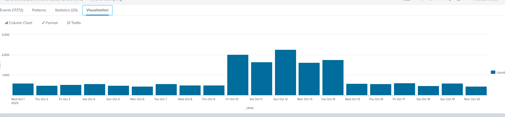
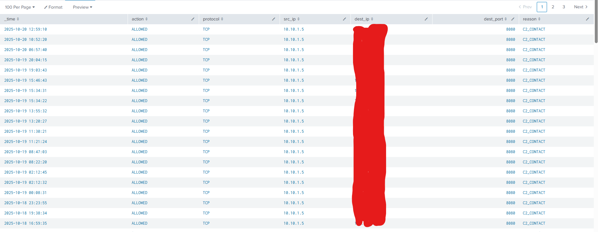

# 🎄 Dzień 3 - Splunk Basics - Did you SIEM?

## 📝 Opis zadania
*Dzisiejsze wyzwanie dotyczyło analizy incydentu bezpieczeństwa w firmie The Best Festival Company. Zespół SOC (Security Operations Center) wykrył wiadomość z żądaniem okupu od grupy "Bandit Bunnies" pod dowództwem King Malhare. Celem zadania było wykorzystanie narzędzia Splunk do przeprowadzenia dochodzenia (log forensics), zidentyfikowania wektora ataku, adresu IP sprawcy oraz potwierdzenia wycieku danych do serwera C2 (Command & Control).*

## 🔍 Kroki do celu
1. **Rekonesans**:
Pierwszym krokiem było zapoznanie się z dostępnymi danymi w Splunk. Zidentyfikowaliśmy dwa kluczowe źródła logów w indeksie main:

* `sourcetype=web_traffic`: Logi serwera WWW (zapytania HTTP, adresy IP klientów, User-Agent).

* `sourcetype=firewall_logs`: Logi sieciowe (ruch wychodzący i przychodzący, transfer bajtów).

Rozpocząłem od zidentyfikowania zewnętrznego adresu IP, który generował nienaturalnie dużą liczbę żądań.
```
index=main sourcetype=web_traffic 
| stats count by client_ip 
| sort -count
```
2. **Analiza**: 
Podczas głębszej analizy ruchu WWW, skupiłem się na podejrzanych wzorcach:

Analiza User-Agent: Szukanie śladów automatycznych skanerów. Zidentyfikowano użycie narzędzi takich jak `sqlmap` oraz `Havij`.

Próby Path Traversal: Poszukiwanie prób dostępu do wrażliwych plików (np. `../../etc/passwd` lub `.env`).

Analiza czasowa: Użycie wizualizacji w celu znalezienia momentu największego nasilenia ataku.

```
index=main sourcetype=web_traffic 
| timechart span=1d count
```
3. **Eksploitacja/Rozwiązanie**: 
Po zidentyfikowaniu adresu IP atakującego, przeanalizowałem aktywność po przełamaniu zabezpieczeń. Atakujący przeszedł przez fazy:

Reconnaissance: Skanowanie w poszukiwaniu plików konfiguracyjnych.

Exploitation: Wykorzystanie podatności SQL Injection (payloady `SLEEP(5)`).

Action on Objective: Uruchomienie skryptu ransomware `bunnylock.bin` przez webshell.

C2 Communication: Na podstawie logów firewalla potwierdziłem, że zainfekowany serwer (`10.10.1.5`) komunikował się z IP atakującego, wysyłając dane.

Zapytanie sprawdzające transfer danych do C2:
```
index=main sourcetype=firewall_logs src_ip="10.10.1.5"
| stats sum(len) by dest_ip
```

> Tip:
> Podczas pracy ze Splunkiem warto używać komendy top limit=10 field_name, aby szybko zorientować się w najczęstszych wartościach podejrzanych pól, co znacznie przyspiesza identyfikację nietypowych User-Agentów

## 📸 Dokumentacja wizualna

*Wizualizacja szczytu aktywności atakującego w czasie.*

*Potwierdzenie połączenia wychodzącego do zewnętrznego adresu IP C2.*

## 🛠️ Użyte narzędzia
* Splunk Enterprise - System klasy SIEM do analizy i wizualizacji logów.
* SPL (Search Processing Language) - Język zapytań używany do filtrowania danych w Splunk.
