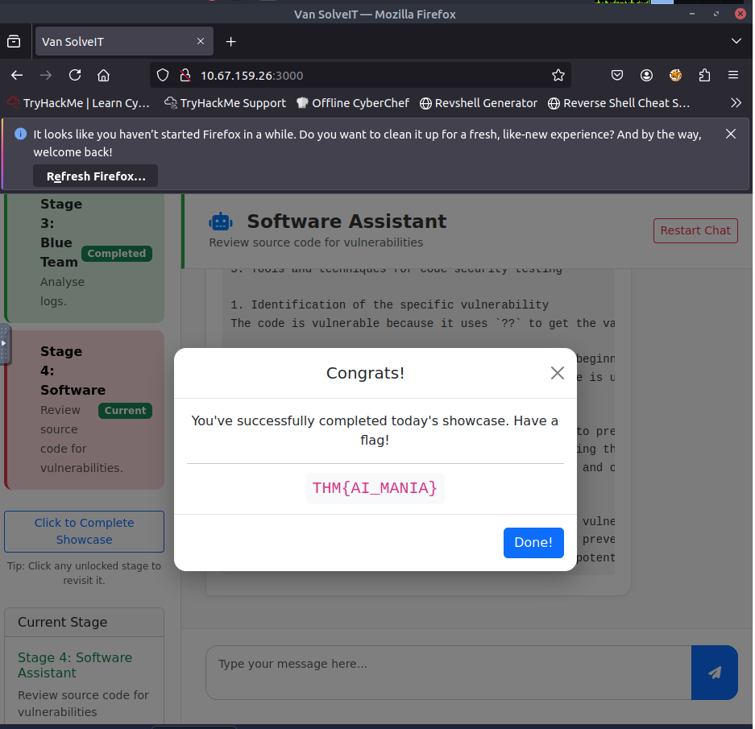
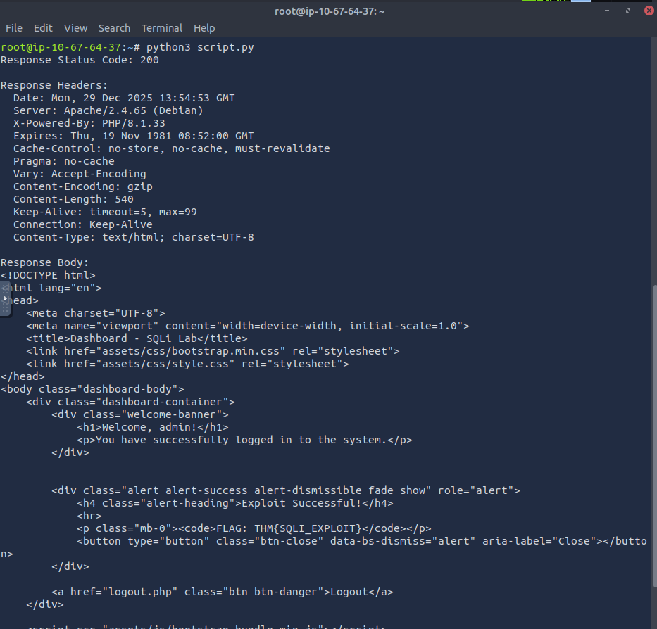

# 🎄 Dzień 4 - AI in Security - old sAInt nick

## 📝 Opis zadania
*Czwarty dzień wyzwania skupiał się na praktycznym zastosowaniu Sztucznej Inteligencji (AI) w cyberbezpieczeństwie. TBFC wdrożyło nowego asystenta o nazwie Van SolveIT, aby usprawnić procesy defensywne i ofensywne. Zadanie polegało na przetestowaniu możliwości chatbota w różnych scenariuszach (analiza logów, audyt kodu), a następnie wykorzystaniu wygenerowanego przez AI skryptu do przeprowadzenia realnego ataku na podatną aplikację webową.*

## 🔍 Kroki do celu
1. **Eksploracja możliwości AI (AI Showcase)**: 
Pierwszym etapem była interakcja z chatbotem Van SolveIT. Przechodząc przez kolejne etapy rozmowy ("stages"), zademonstrowano, jak AI potrafi wspierać analityków SOC w:
* Wykrywaniu anomalii w logach.
* Analizie kodu pod kątem luk bezpieczeństwa.
* Sugerowaniu poprawek (remediation). Po ukończeniu demonstracji otrzymano pierwszą flagę potwierdzającą zapoznanie się z narzędziem.

2. **Atak wspomagany przez AI (AI-Assisted Exploitation)**: W fazie "Red Team", AI wygenerowało gotowy skrypt w języku Python, służący do eksploitacji podatności w testowej aplikacji.
* Analiza skryptu: Kod miał na celu wysłanie spreparowanego żądania do serwera.
* Modyfikacja: Skrypt wymagał ręcznej edycji – należało podmienić placeholder adresu IP na adres maszyny docelowej (MACHINE_IP) oraz wskazać odpowiedni port (5001).
* Eksploitacja: Po uruchomieniu skryptu w terminalu, aplikacja zwróciła odpowiedź zawierającą ukrytą flagę.

> 💡AI jako narzędzie wspomagające
> Ten dzień pokazał, że choć AI potrafi generować działające exploity, wciąż wymagany jest czynnik ludzki ("Human in the loop"). Bez zrozumienia kodu i ręcznej konfiguracji parametrów (takich jak IP czy port), wygenerowane rozwiązanie byłoby bezużyteczne.

## 📸 Dokumentacja wizualna

*Interfejs asystenta Van SolveIT podczas analizy zagrożeń.*

*Wynik działania skryptu Python z widoczną flagą końcową.*

## 🛠️ Użyte narzędzia
* Van SolveIT (AI Chatbot) – generowanie kodu i analiza.
* Text Editor Vim – edycja parametrów w skrypcie.
* Python – uruchomienie skryptu atakującego.
