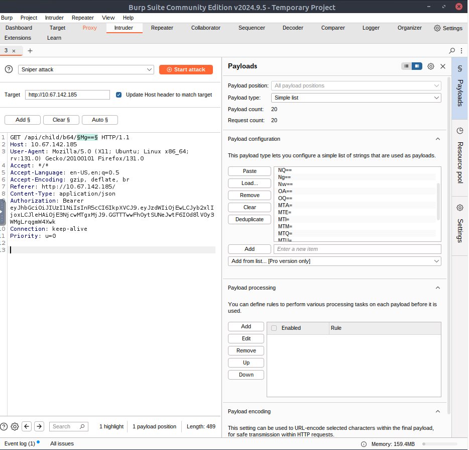
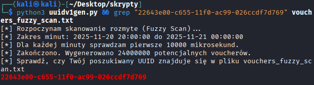

# 🎄 Dzień 5 - IDOR - Santa’s Little IDOR

## 📝 Opis zadania
*Piąty dzień wyzwania skupiał się na podatności IDOR (Insecure Direct Object References). W scenariuszu, w którym elfy zgłaszały problemy z aktywacją voucherów na stronie TryPresentMe, zadaniem było zbadanie mechanizmów autoryzacji. Podatność polegała na braku weryfikacji, czy użytkownik żądający dostępu do danego zasobu (np. koszyka zakupowego lub profilu) jest do tego uprawniony, co umożliwiło horyzontalną eskalację uprawnień.*

## 🔍 Kroki do celu
1. **Rekonesans i Manipulacja Parametrami (Browser DevTools)**:
Pierwszym etapem było zrozumienie, jak aplikacja identyfikuje użytkowników.
* Analiza w zakładce Network narzędzi deweloperskich przeglądarki ujawniła, że aplikacja przekazuje identyfikator użytkownika w parametrze URL (np. `view_account`).
* Poprzez manualną zmianę wartości parametru (IDOR), udało się uzyskać dostęp do koszyków innych użytkowników.
* Cel: Znalezienie konta z 15 przedmiotami w koszyku (udało się to przy `user_id=15`).
2. **Automatyzacja ataku na ID (Burp Intruder)**: 
Kolejne zadanie (Bonus Task 1) wymagało znalezienia konkretnego użytkownika na podstawie daty urodzenia (17.04.2019). Ręczne sprawdzanie nie wchodziło w grę.
* Przechwycono żądanie w Burp Suite i przekierowano je do modułu Intruder.
* Zidentyfikowano, że parametr id_number jest przesyłany, ale wartości są potencjalnie kodowane (Base64/Integer).
* Uruchomiono atak typu Fuzzing na parametr ID, analizując odpowiedzi pod kątem występowania szukanej daty.
* Wynik: Znaleziono pasujący profil pod ID numer 19.
3. **Łamanie UUID v1 (Python Scripting)**: 
Najtrudniejszym elementem (Bonus Task 2) było odnalezienie vouchera wygenerowanego w konkretnym oknie czasowym (20 listopada 2025, 20:00 - 00:00).
* Zidentyfikowano format identyfikatora jako UUID v1, który zawiera w sobie znacznik czasu (timestamp).
* Ponieważ próba generowania kodów co minutę zawiodła, konieczne było bardziej precyzyjne podejście (interwał 0.01 sekundy).
* Napisano/użyto skryptu uuidv1gen.py, który wygenerował listę 24 milionów potencjalnych UUID dla zadanego przedziału czasowego.
* Użycie Burp Intrudera w celu weryfikacji poprawności poszukiwanego vouchera mogłaby okazać się bardzo czasochłonna, więc zdecydowano na użycie narzędzia grep do przefiltrowania wyników i znalezienia poprawnego tokena.
> 💡 Ciekawostka
> Dlaczego UUID v1 jest niebezpieczne? W przeciwieństwie do UUID v4 (które jest całkowicie losowe), wersja 1 jest generowana na podstawie adresu MAC karty sieciowej oraz aktualnego czasu. Pozwala to atakującemu na przewidzenie wartości tokena, jeśli zna czas jego utworzenia, co zostało wykorzystane w tym zadaniu.

## 📸 Dokumentacja wizualna

*Zmiana parametru user_id w narzędziach deweloperskich w celu podejrzenia koszyka innego użytkownika.*

*Konfiguracja ataku w Burp Intruder w celu znalezienia użytkownika po dacie urodzenia.*

*Wynik działania skryptu generującego miliony UUID i skuteczne znalezienie flagi.*

## 🛠️ Użyte narzędzia
* Browser DevTools (Network Tab) – analiza zapytań HTTP.
* Burp Suite (Intruder) – automatyzacja zapytań i fuzzing.
* Python (uuidv1gen.py) – generowanie słowników UUID opartych na czasie.
* Grep – filtrowanie dużych zbiorów danych.
