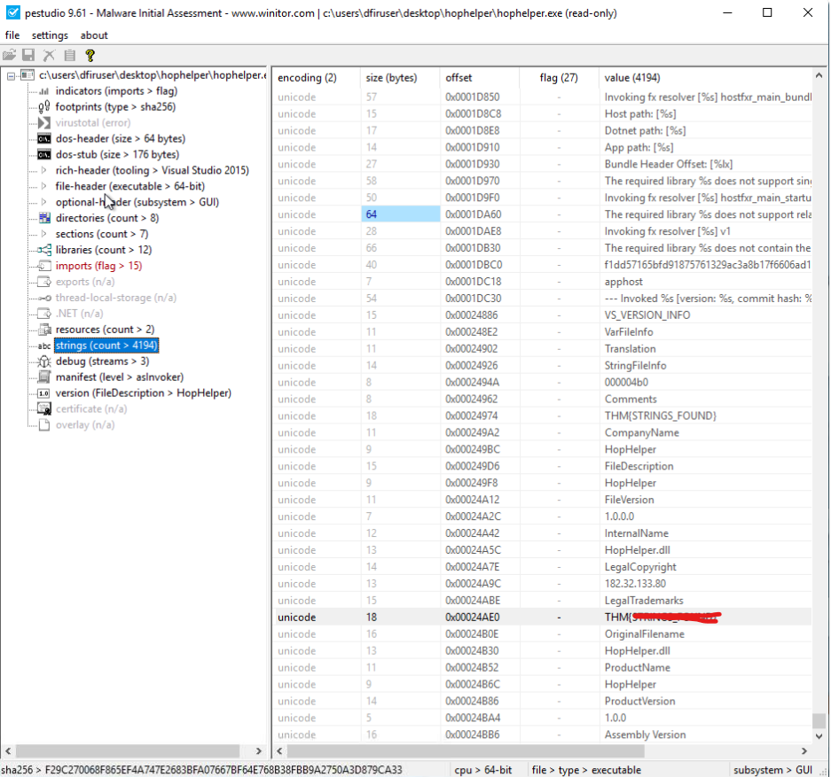
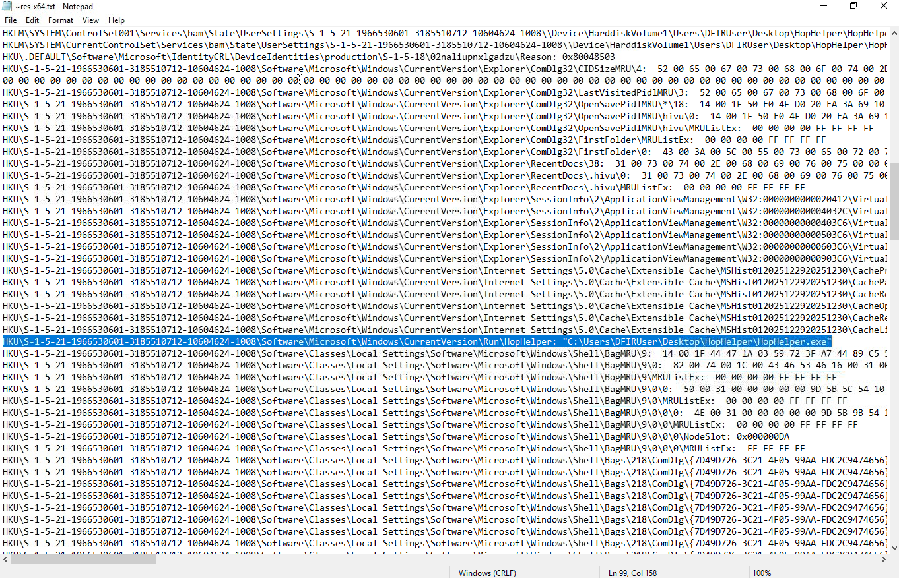
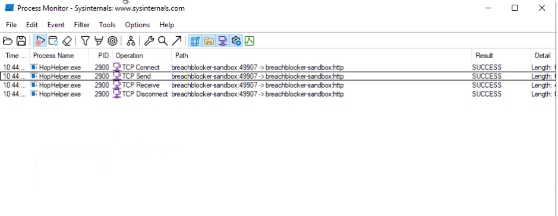

# 🎄 Dzień 6 -  Malware Analysis - Egg-xecutable

## 📝 Opis zadania
Szósty dzień wyzwania wprowadził nas w świat analizy złośliwego oprogramowania. Scenariusz dotyczył podejrzanego pliku wykonywalnego `HopHelper.exe`, który został rozesłany do elfów pod pretekstem nowego harmonogramu pracy. Zadanie polegało na bezpiecznym zbadaniu próbki w środowisku typu Sandbox, aby zrozumieć jej zachowanie, zidentyfikować wskaźniki kompromitacji (IOC) oraz wykryć mechanizmy persystencji (utrwalania się w systemie).

## 🔍 Kroki do celu
1. **Analiza Statyczna (Static Analysis)**: 
Pierwszym etapem było zbadanie pliku bez jego uruchamiania. Pozwala to na wstępną identyfikację zagrożenia na podstawie metadanych i zawartości binarnej.
* Weryfikacja tożsamości pliku: Użyto narzędzia Pestudio (lub sha256sum) do wygenerowania skrótu SHA256. Unikalny hash pozwala na sprawdzenie próbki w bazach takich jak VirusTotal.
* Analiza ciągów znaków (Strings): Przeglądając zaszyte w pliku teksty (strings) w Pestudio, odnaleziono ukrytą flagę tekstową, która nie została zaciemniona (obfuskowana).
2. **Przygotowanie do Analizy Dynamicznej**: 
Przed uruchomieniem malware'u przygotowano środowisko monitorujące, aby zarejestrować wszystkie zmiany wprowadzane w systemie.
* RegShot: Wykonano pierwszy zrzut rejestru systemowego ("1st shot") przed infekcją, aby mieć punkt odniesienia do porównania (baseline).
3. **Analiza Dynamiczna (Dynamic Analysis)**:
Po uruchomieniu HopHelper.exe obserwowano jego zachowanie w czasie rzeczywistym.
* Monitorowanie procesów: Narzędzia takie jak Process Monitor i Process Hacker pozwoliły śledzić aktywność pliku.
* Wykrywanie persystencji: Po wykonaniu drugiego zrzutu rejestru ("2nd shot") w RegShot i porównaniu go z pierwszym, wykryto nowy wpis w kluczu Run. Malware dodał się do autostartu, aby uruchamiać się przy każdym logowaniu użytkownika.
4. **Analiza Komunikacji Sieciowej (Procmon)**
W celu zidentyfikowania wskaźników sieciowych (Network Indicators), wykorzystano narzędzie Process Monitor (Procmon).
* Śledząc aktywność procesu HopHelper.exe, zaobserwowano próby nawiązania połączenia zewnętrznego.
* Malware próbował komunikować się za pomocą protokołu HTTP z hostem breachblocker-sandbox na niestandardowym porcie 49907.

[!TIP] Dlaczego Procmon? Process Monitor to narzędzie, które "widzi wszystko". Rejestruje operacje na plikach, rejestrze, a także aktywność sieciową. Jest niezastąpiony, gdy malware nie generuje widocznych okien, a chcemy sprawdzić, do jakich adresów (C2) próbuje się "dodzwonić".

> 💡 Wnioski i Ciekawostki
> Dlaczego RegShot? Malware często próbuje "przeżyć" restart systemu (Persistence). Najczęstszą metodą jest modyfikacja kluczy rejestru `HKCU\...\Run` lub `HKLM\...\Run`. RegShot to najszybsza metoda na wyłapanie tych zmian poprzez analizę różnicową (diff) stanu rejestru.

## 📸 Dokumentacja wizualna

*Pestudio wyświetlające hash SHA256 oraz odnalezione ciągi znaków (strings).*

*Wynik porównania w RegShot ujawniający ścieżkę do złośliwego pliku dodaną do autostartu.*

*Dynamiczna analiza ruchu TCP aplikacji HopHelper.exe*

## 🛠️ Użyte narzędzia
* Pestudio – wstępna analiza statyczna, hashe i strings.
* RegShot – analiza różnicowa rejestru systemowego.
* Process Monitor (ProcMon) – monitorowanie systemu plików i rejestru w czasie rzeczywistym.
