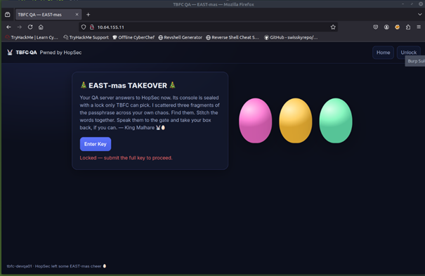
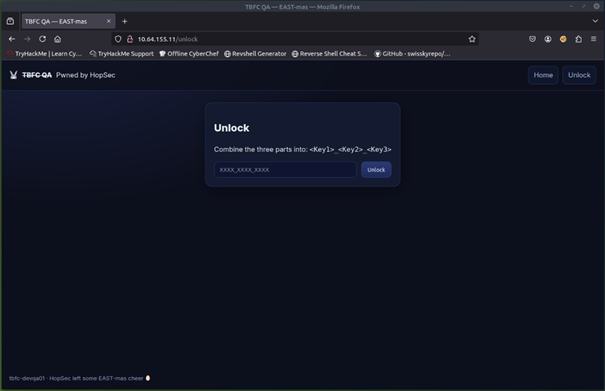
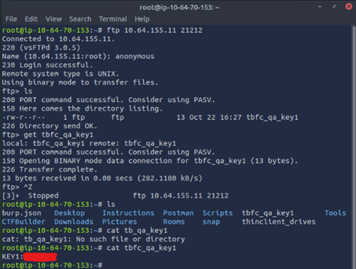
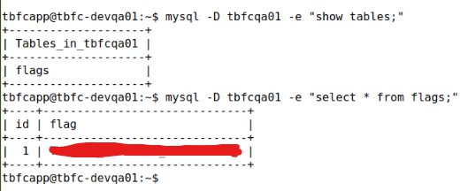

# 🎄 Dzień 7 - Network Discovery - Scan-ta Clause

## 📝 Opis zadania
Siódmy dzień wyzwania polegał na analizie sieci i ujawnieniu usług, w celu zdobycia trzech kluczy, które odblokowywały dostęp do panelu administracyjnego (Web Console). Ostatnim etapem była eksploracja bazy danych MySQL dostępnej przez ten panel, aby zdobyć główną flagę.

## 🔍 Kroki do celu

1. **Rekonesans i Skanowanie Podstawowe**:
   Rozpoczęto od skanowania portów (`nmap`), wykrywając porty 22 (SSH) i 80 (HTTP). Strona WWW żądała hasła w formacie `<Key1>_<Key2>_<Key3>`.

2. **Głębsza Analiza (TCP)**:
   Skanowanie wszystkich portów z detekcją banerów (`nmap -p- --script=banner`) ujawniło ukryte usługi na portach **21212** i **25251**.

3. **Klucz 1 (FTP - Port 21212)**:
   Połączono się przez FTP (login: `anonymous`), skąd pobrano plik z pierwszą częścią hasła.
```
bash
ftp 10.64.155.11 21212
get tbfc_qa_key1
```

4. **Klucz 2 (TBFC App - Port 25251)**:
Użyto `netcat` do połączenia z niestandardową aplikacją nasłuchującą na tym porcie, co zwróciło drugi klucz.

```
bash
nc -v 10.64.155.11 25251

```
5. **Klucz 3 (DNS/UDP - Port 53)**:
Skanowanie UDP (`nmap -sU`) wykazało otwarty port 53. Za pomocą narzędzia `dig` odpytano serwer o rekord TXT, uzyskując trzeci klucz.
```
bash
dig @10.64.155.11 TXT key3.tbfc.local +short

```
6. **Finał: Web Console i MySQL**:
Po wpisaniu złożonego hasła na stronie, uzyskano dostęp do webowej konsoli. Umożliwiła ona interakcję z systemem. Wykorzystano ją do przeszukania bazy danych MySQL (enumeracja tabel i kolumn), gdzie w jednej z tabel znaleziono ostateczną flagę.

> 💡 Wnioski i Ciekawostki
> W przypadku trzeciego klucza (DNS), samo skanowanie portów nie wystarczyło. Informacja o domenie key3.tbfc.local nie była rozgłaszana i wymagała wnikliwej analizy treści zadania (OSINT/Context Analysis). Pokazuje to, że w pentestach techniczne skanowanie musi iść w parze ze zrozumieniem logiki biznesowej celu.

## 📸 Dokumentacja wizualna

*Rysunek 1: Rekonesans i strona logowania.*




*Rysunek 2: Zdobywanie kluczy przez FTP i Netcat.*




*Rysunek 3: Wydobycie klucza z rekordu DNS.*


*Rysunek 4: Dostęp do konsoli i ekstrakcja flagi z bazy danych.*



## 🛠️ Użyte narzędzia

* Nmap, FTP, Netcat, Dig
* Web Console / SQL Queries
