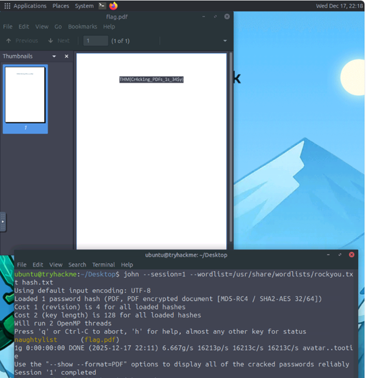
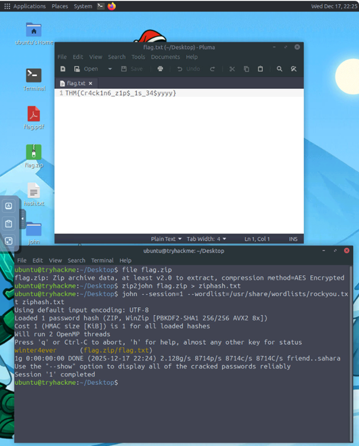

# 🎄 Dzień 9 - Passwords - A Cracking Christmas

## 📝 Opis zadania
*Zadanie polegało na przeprowadzeniu audytu bezpieczeństwa dwóch zaszyfrowanych plików: dokumentu PDF oraz archiwum ZIP. Celem było wykorzystanie techniki ataku słownikowego (Dictionary Attack) do odzyskania haseł i uzyskania dostępu do ukrytych flag.*

## 🔍 Kroki do celu
1. **Rekonesans**: Zidentyfikowano pliki flag.pdf oraz flag.zip. Analiza wykazała, że pliki są zabezpieczone hasłami, co wymagało wyodrębnienia ich skrótów (hashy) przed przystąpieniem do łamania.
2. **Analiza**: Do przekonwertowania plików na format zrozumiały dla programu John the Ripper użyto dedykowanych narzędzi:
'''
# Ekstrakcja hasha z PDF
pdf2john flag.pdf > hash_pdf.txt

# Ekstrakcja hasha z ZIP
zip2john flag.zip > hash_zip.txt
'''
3. **Eksploitacja/Rozwiązanie**: 3. Atak Słownikowy

Wykorzystano narzędzie John the Ripper wraz z listą haseł rockyou.txt. Atak zakończył się sukcesem niemal natychmiastowo ze względu na niską złożoność haseł.
'''
# Łamanie hasła PDF
john --wordlist=/usr/share/wordlists/rockyou.txt hash_pdf.txt

# Łamanie hasła ZIP
john --wordlist=/usr/share/wordlists/rockyou.txt hash_zip.txt
'''

## 📸 Dokumentacja wizualna

*Rysunek 1: atak słownikowy na plik PDF oraz odczytanie flagi.*

*Rysunek 2: Atak słownikowy na archiwum ZIP i odczytanie flagi z pliku tekstowego.*

## 🛠️ Użyte narzędzia
* John the Ripper
* pdf2john / zip2john
* rockyou.txt
