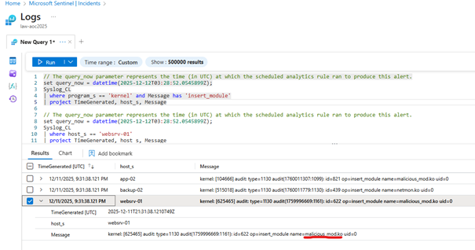
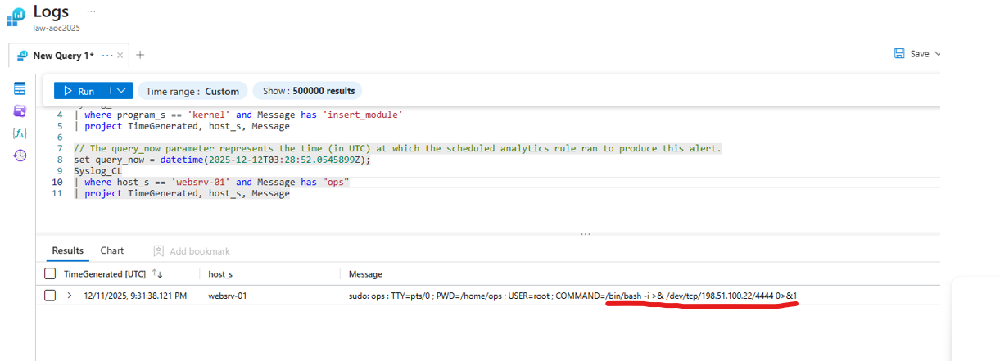
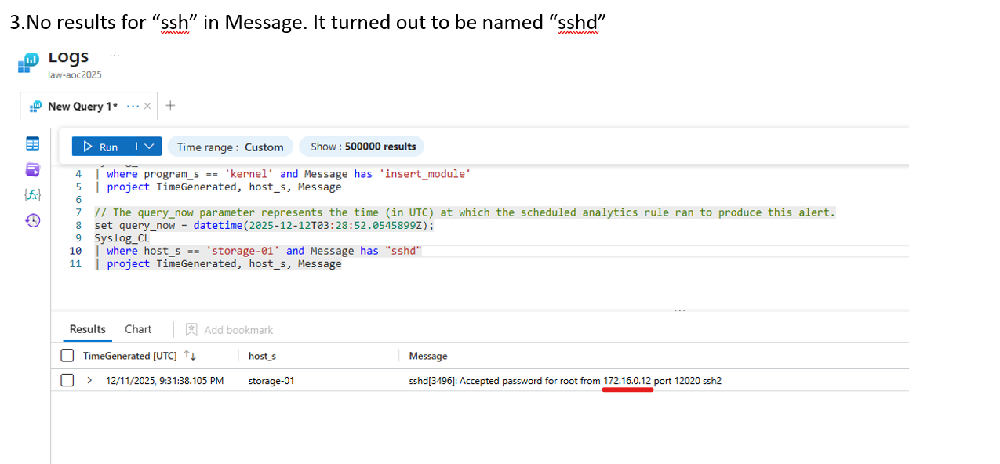
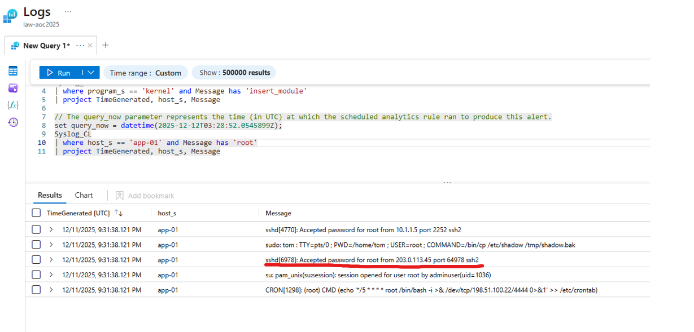
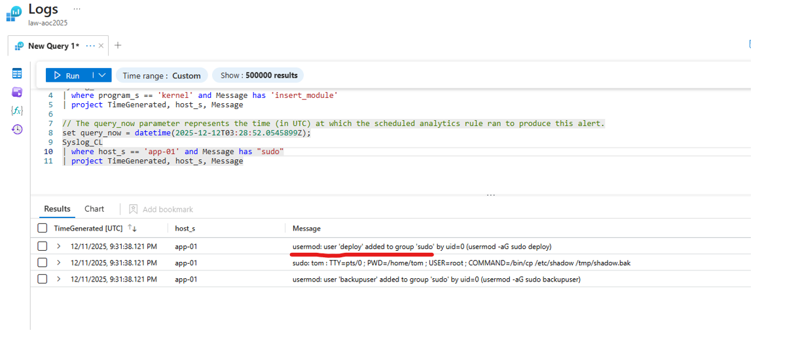

# 🎄 Dzień 10 - SOC Alert Triaging (Tinsel Triage)

## 📝 Opis zadania
Dzisiejsze zadanie polegało na pracy analitycznej w centrum operacji bezpieczeństwa (SOC). Wykorzystano platformę Microsoft Azure oraz narzędzie Microsoft Sentinel do analizy alertów, weryfikacji logów systemowych oraz rekonstrukcji osi czasu ataku na infrastrukturę chmurową

## 🔍 Kroki do celu
1. **Analiza dashboardu i Triage**: Pracę rozpoczęto od przeglądu incydentów w panelu Azure Sentinel. Skupiono się na alertach o wysokim priorytecie, dotyczących podejrzanych logowań SSH oraz użycia komend administracyjnych. Proces obejmował weryfikację logiki detekcji oraz powiązanych rekordow (użytkowników i adresów IP).
2. **Analiza alertów**: Pierwszy etap dochodzenia skupiał się na szczegółowej weryfikacji alertów w panelu Microsoft Sentinel. Proces wymagał sprawnego poruszania się po metadanych incydentów, takich jak stopień krytyczności (Severity) oraz powiązane zasoby (Affected Entities).

Kluczowym punktem analizy okazał się alert dotyczący eskalacji uprawnień: Linux PrivEsc - User Added to Sudo Group. Wyzwaniem była precyzyjna identyfikacja liczby kont, które faktycznie uzyskały uprawnienia administracyjne. W toku analizy encji (Entities) wyodrębniono:
* 11 urządzeń (Hosty), na których odnotowano aktywność.
* 4 konta użytkowników, które zostały dodane do grupy sudoers.
3. **Zaawansowana analityka logów i rekonstrukcja ataku (KQL Investigation)**: Ostatnia faza zadania polegała na przeprowadzeniu głębokiej analizy logów źródłowych (Deep Log Analysis) w celu udzielenia odpowiedzi na szczegółowe pytania dotyczące przebiegu incydentu. Wykorzystano zapytania w języku KQL (Kusto Query Language), które pozwoliły na precyzyjne odfiltrowanie zdarzeń z tysięcy rekordów zgromadzonych w Microsoft Sentinel i odtworzenie osi czasu działań intruza.

## 📸 Dokumentacja wizualna

*Kernel zainstalowany na websrv-01*

*Podejrzana komenda na websrv-01 polecona przez ops*

*Udane polaczenie ssh z storage-01 *

*Udane logowane z uprawnieniami roota*

*Uzytkownik dodany do grupy sudoers*

## 🛠️ Użyte narzędzia
* Microsoft Azure Panel
* Microsoft Sentinel
* KQL (Kusto Query Language)
