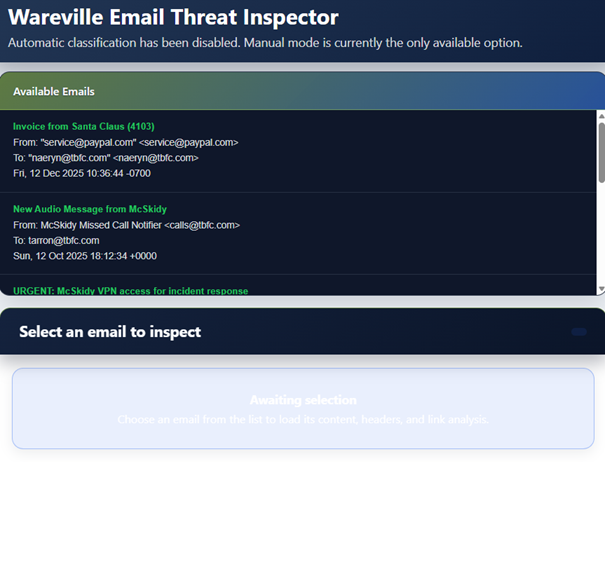
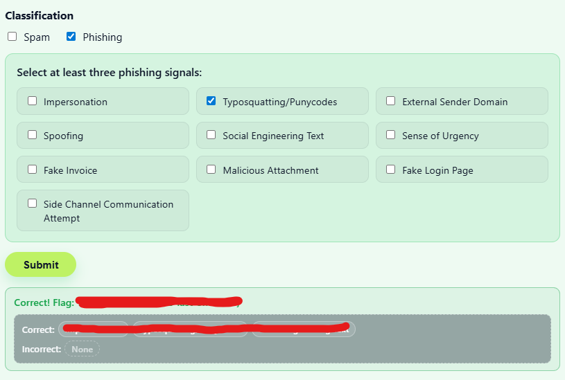
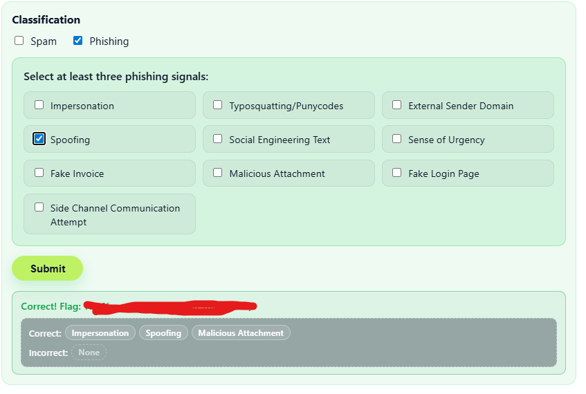

# 🎄 Dzień 12 - Phishing - Phishmas Greetings

## 📝 Opis zadania
*Dwunasty dzień wyzwania poświęcony był analizie zagrożeń przesyłanych drogą mailową. Jako analityk SOC wykorzystałem narzędzie Wareville Email Threat Inspector do dokonania triażu przychodzącej korespondencji. Celem była poprawna klasyfikacja wiadomości jako Spam lub Phishing oraz identyfikacja konkretnych wskaźników ataku (signals).*

## 🔍 Kroki do celu
1. **Rekonesans i przegląd kolejki**: 
Uruchomiono inspektora maili w trybie manualnym. Analiza skupiła się na weryfikacji nagłówków (nadawca, odbiorca, data) oraz treści wiadomości pod kątem socjotechniki i podejrzanych załączników.
2. **Analiza sygnałów phishingowych (Indicators)**: 
Podczas analizy wykryto szereg zaawansowanych technik stosowanych przez napastników. Każdy przypadek phishingu musiał zostać udokumentowany przynajmniej trzema sygnałami potwierdzającymi zagrożenie. Zidentyfikowano następujące wektory:

* Impersonation & Spoofing: Podszywanie się pod zaufane osoby (np. McSkidy) lub usługi (PayPal), często z użyciem sfałszowanych adresów nadawcy.

* Typosquatting & Punycode: Wykorzystanie domen łudząco podobnych do oryginalnych (np. drobne literówki w nazwie firmy).

* Social Engineering & Sense of Urgency: Budowanie sztucznego poczucia presji czasu, aby zmusić ofiarę do podjęcia pochopnych działań (np. pilna aktualizacja VPN).

* Side Channel Communication: Próby nawiązania kontaktu poza głównym kanałem mailowym.
3. **Analiza techniczna załączników i linków**: 
Wykryto próby wykorzystania zaufanych aplikacji (Legitimate Applications) do maskowania złośliwych działań oraz przekierowania do fałszywych stron logowania (Fake Login Pages), mających na celu wyłudzenie poświadczeń.

## 📸 Dokumentacja wizualna

*Interfejs Email Threat Inspector z listą wiadomości oczekujących na analizę.*

*Przykład wiadomości typu Phishing z widocznymi błędami w domenie nadawcy (Typosquatting).*

*Poprawna klasyfikacja maila wraz z zaznaczonymi sygnałami zagrożenia.*

## 🛠️ Użyte narzędzia
* Wareville Email Threat Inspector – dedykowane narzędzie do analizy 	  bezpieczeństwa poczty.

* Header & Content Analysis – metodyka manualnego badania autentyczności wiadomości.
