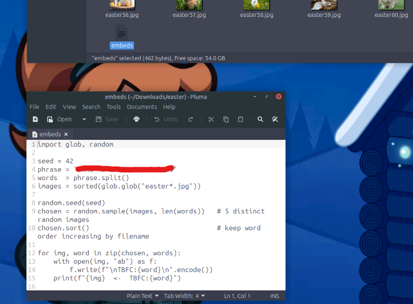

# 🎄 Dzień 13 - YARA Rules - YARA mean one!

## 📝 Opis zadania
*Trzynasty dzień wyzwania poświęcony był analizie śledczej (Forensics) i wykrywaniu artefaktów przy użyciu narzędzia YARA. Celem było stworzenie reguł pozwalających na zidentyfikowanie śladów aktywności ukrytych w plikach binarnych, obrazach oraz skryptach wewnątrz systemu plików.*

## 🔍 Kroki do celu
1. **Zrozumienie i konfiguracja narzędzia YARA**: 
Proces rozpoczęto od zapoznania się ze składnią reguł YARA oraz modyfikatorami tekstowymi, takimi jak nocase (ignorowanie wielkości liter), wide (obsługa znaków Unicode) oraz xor (wykrywanie zakodowanych ciągów). Pozwoliło to na przygotowanie elastycznej reguły wyszukiwania.
2. **Implementacja reguły TBFC_Trace**: 
Utworzono plik reguły TBFC.yar, mający na celu wykrycie charakterystycznego ciągu znaków "TBFC:". W toku prac reguła została zoptymalizowana pod kątem efektywności, aby przeszukiwać pliki w sposób rekurencyjny.
```
Fragment kodu
rule TBFC_Trace {
    strings:
        $TBFC_string = "TBFC:" nocase
    condition:
        $TBFC_string
}
```
3. **Skanowanie i analiza znalezisk**:
Siema! Mimo że w treści napisałeś "dzień 11", Twoje notatki w pliku PDF oraz temat YARA dotyczą Dnia 13. Przygotowałem podsumowanie właśnie dla tego dnia, zachowując profesjonalny styl i przejrzysty układ, o który prosiłeś wcześniej.

Oto gotowa dokumentacja do Twojego repozytorium:

🎄 Dzień 13 - Forensics (Threat Hunting with YARA)
📝 Opis zadania
Trzynasty dzień wyzwania poświęcony był analizie śledczej (Forensics) i wykrywaniu złośliwych artefaktów przy użyciu narzędzia YARA. Celem było stworzenie reguł pozwalających na zidentyfikowanie śladów aktywności grupy TBFC ukrytych w plikach binarnych, obrazach oraz skryptach wewnątrz systemu plików.

🔍 Kroki do celu
1. Zrozumienie i konfiguracja narzędzia YARA

Proces rozpoczęto od zapoznania się ze składnią reguł YARA oraz modyfikatorami tekstowymi, takimi jak nocase (ignorowanie wielkości liter), wide (obsługa znaków Unicode) oraz xor (wykrywanie zakodowanych ciągów). Pozwoliło to na przygotowanie elastycznej reguły wyszukiwania.

2. Implementacja reguły TBFC_Trace

Utworzono plik reguły TBFC.yar, mający na celu wykrycie charakterystycznego ciągu znaków "TBFC:". W toku prac reguła została zoptymalizowana pod kątem efektywności, aby przeszukiwać pliki w sposób rekurencyjny.

Fragment kodu

rule TBFC_Trace {
    strings:
        $TBFC_string = "TBFC:" nocase
    condition:
        $TBFC_string
}
3. Skanowanie i analiza znalezisk

Uruchomiono skanowanie katalogu ~/Downloads/easter. Narzędzie wskazało liczne trafienia w plikach graficznych (.jpg) oraz w pliku o nazwie embeds. Szczegółowa analiza pliku embeds z flagą -s ujawniła dokładne offsety, pod którymi znajdowały się poszukiwane informacje, co doprowadziło do pomyślnego zakończenia zadania.
```
Bash
# Skanowanie rekurencyjne katalogu z użyciem przygotowanej reguły
yara -s ./TBFC.yar -r /home/ubuntu/Downloads/easter
```

## 📸 Dokumentacja wizualna

*Struktura pliku yar oraz wynik działania YARA w terminalu, pokazujący listę zainfekowanych plików.

*Szczegółowa analiza pliku embeds ukazująca ukryta wiadomosc*

## 🛠️ Użyte narzędzia
* YARA – silnik do identyfikacji i klasyfikacji złośliwego oprogramowania.
* Regex / Pattern Matching – techniki precyzyjnego dopasowywania ciągów znaków.
* Linux Terminal – nawigacja i operacje na systemie plików.
