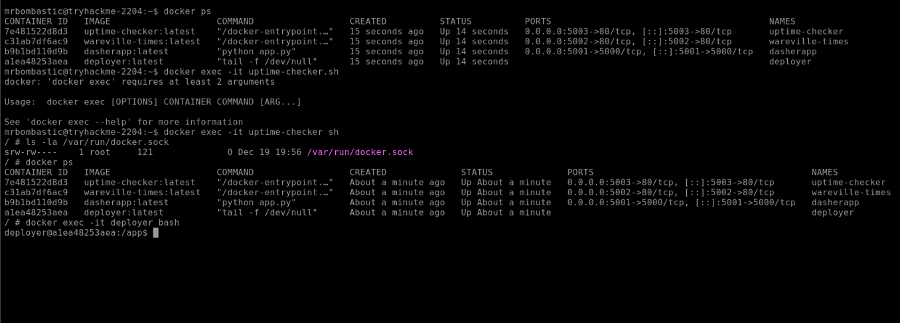
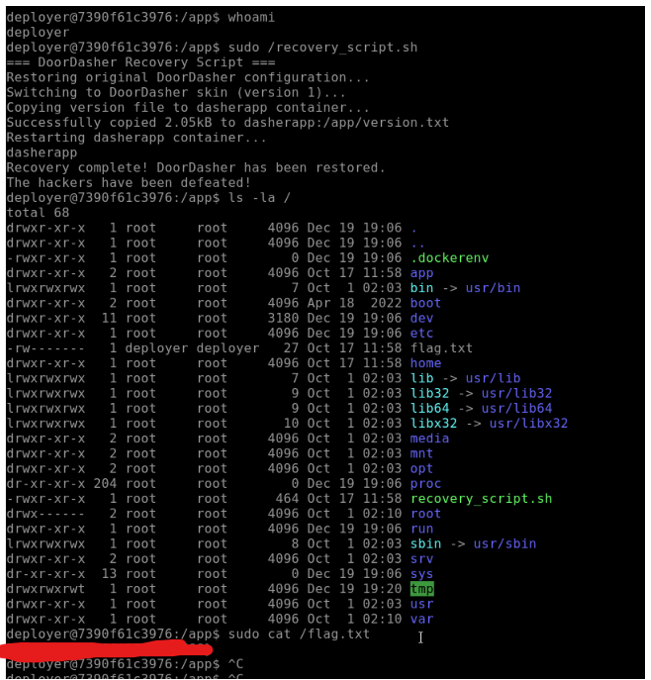
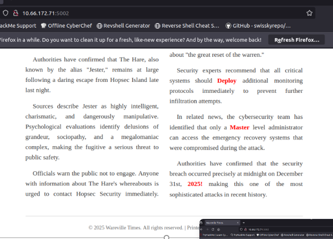

# 🎄 Dzień 14 - Containers - DoorDasher's Demise

## 📝 Opis zadania
*Czternasty dzień wyzwania dotyczył bezpieczeństwa środowisk kontenerowych i nadużyć wynikających ze złej konfiguracji gniazda Docker (docker.sock). Zadanie polegało na przeprowadzeniu audytu wewnątrz kontenera monitorującego, wykryciu dostępu do silnika Docker hosta oraz wykonaniu ataku typu Lateral Movement, aby przejąć kontrolę nad kontenerem deployer o wyższych uprawnieniach.*

## 🔍 Kroki do celu
1. **Rekonesans i dostęp do kontenera monitorującego**: 
Pracę rozpoczęto od uzyskania dostępu do podstawowego kontenera o nazwie uptime-checker. Pierwszym krokiem była enumeracja działających procesów i sprawdzenie tożsamości wewnątrz środowiska.
```
Bash
# Sprawdzenie działających kontenerów z poziomu dostępnej powłoki
docker ps

# Uzyskanie interaktywnego dostępu do powłoki kontenera monitorującego
docker exec -it uptime-checker sh
```
2. **Wykrycie podatności Docker Socket**: 
PWewnątrz kontenera uptime-checker przeprowadzono audyt zamontowanych wolumenów. Odkryto, że kontener ma dostęp do gniazda Docker hosta, co pozwala na kontrolowanie całego środowiska kontenerowego z poziomu nieuprzywilejowanego poda.
```
Bash
# Potwierdzenie obecności i uprawnień do gniazda Docker
ls -la /var/run/docker.sock
```
3. **Lateral Movement do kontenera Deployer**:
Wykorzystując dostęp do gniazda, zidentyfikowano kontener o nazwie deployer. Ze względu na jego rolę w infrastrukturze, posiadał on znacznie wyższe uprawnienia i dostęp do wrażliwych danych. Wykonano "skok" boczny, przenosząc powłokę do bardziej uprzywilejowanego środowiska.
```
Bash
# Przejście do kontenera o wyższych uprawnieniach (deployer)
docker exec -it deployer bash
```
4. **Odzyskanie flagi z "Wareville Times"**:
Finałowym krokiem była analiza artykułu w gazecie "Wareville Times" dostepnej na porcie `:5002`, gdzie po złożeniu wyróżnionych słów uzyskano flagę: DeployMaster2025!.


## 📸 Dokumentacja wizualna

*Wykrycie gniazda /var/run/docker.sock wewnątrz kontenera uptime-checker.*


*Sukcesywne przejście do uprzywilejowanego kontenera deployer i uruchomienie skryptu*

*Odnalezienie flagi w gazecie.*


## 🛠️ Użyte narzędzia
* Docker CLI – zarządzanie kontenerami i wykonywanie poleceń przez gniazdo.
* Bash/Sh – interaktywna komunikacja z systemem plików kontenerów.
