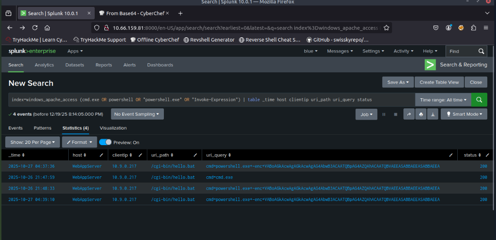
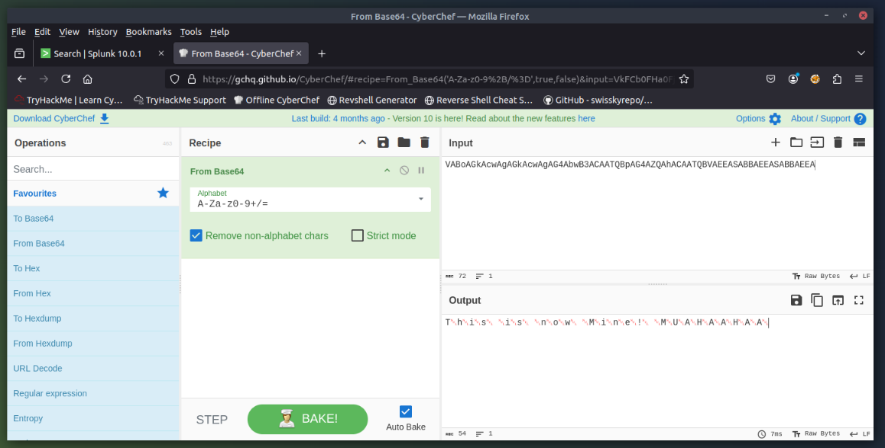

# 🎄 Dzień 15 - Web Attack Forensics - Drone Alone

## 📝 Opis zadania
*Piętnasty dzień wyzwania to intensywna praca po stronie defensywnej (Blue Teaming). Zadanie polegało na przeprowadzeniu pełnej analizy śledczej ataku na infrastrukturę sterowania dronami. Wykorzystując platformę Splunk, zrekonstruowano ścieżkę ataku: od wykrycia próby wstrzyknięcia komend przez serwer Apache, aż po analizę zaciemnionych (obfuscated) procesów PowerShell.*

## 🔍 Kroki do celu
1. **Wykrywanie podejrzanych komend webowych**: 
Analizę rozpoczęto od korelacji logów dostępu serwera Apache. Skupiono się na identyfikacji żądań HTTP, które w parametrach zawierały próby wywołania interpreterów poleceń lub groźnych funkcji systemowych.
```
Fragment kodu
# Zapytanie identyfikujące próby Command Injection w logach Apache
index=windows_apache_access (cmd.exe OR powershell OR "powershell.exe" OR "Invoke-Expression") 
| table _time host clientip uri_path uri_query status
```
2. **Identyfikacja rekonesansu poeksploatacyjnego**: 
Po potwierdzeniu włamania, zbadano aktywność wewnątrz systemu za pomocą logów Sysmon. Ustalono, że napastnik natychmiast po uzyskaniu dostępu uruchomił plik whoami.exe, aby zweryfikować uprawnienia konta, na którym działa usługa webowa. Pozwoliło to potwierdzić, że wstrzyknięty kod został pomyślnie wykonany na hoście.
3. **Analiza zakodowanych ładunków PowerShell**: 
Ostatni etap polegał na wykryciu prób utrzymania dostępu i wykonania złośliwych skryptów. Napastnicy często kodują komendy w Base64, aby ominąć systemy IDS/IPS. Zastosowano zaawansowane filtrowanie linii komend w celu odnalezienia tych ukrytych operacji.
```
Fragment kodu
# Wyszukiwanie zakodowanych komend PowerShell w zdarzeniach Sysmon
index=windows_sysmon Image="*powershell.exe" (CommandLine="*enc*" OR CommandLine="*-EncodedCommand*" OR CommandLine="*Base64*")
```

## 📸 Dokumentacja wizualna

*Tabela wyników w Splunk pokazująca adresy IP napastników oraz zmanipulowane ścieżki URI.*

*Wizualizacja zdarzeń Sysmon potwierdzająca uruchomienie procesów przez serwer webowy.*

*Przechwycone i zdekodowane polecenia PowerShell ujawniające intencje intruza.*

## 🛠️ Użyte narzędzia
* Splunk Enterprise – platforma SIEM do centralizacji i analizy logów.
* SPL (Search Processing Language) – tworzenie precyzyjnych zapytań śledczych.
* Windows Sysmon – zaawansowane monitorowanie procesów i zdarzeń systemowych.
