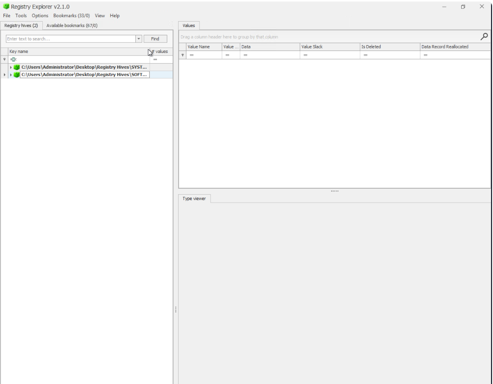
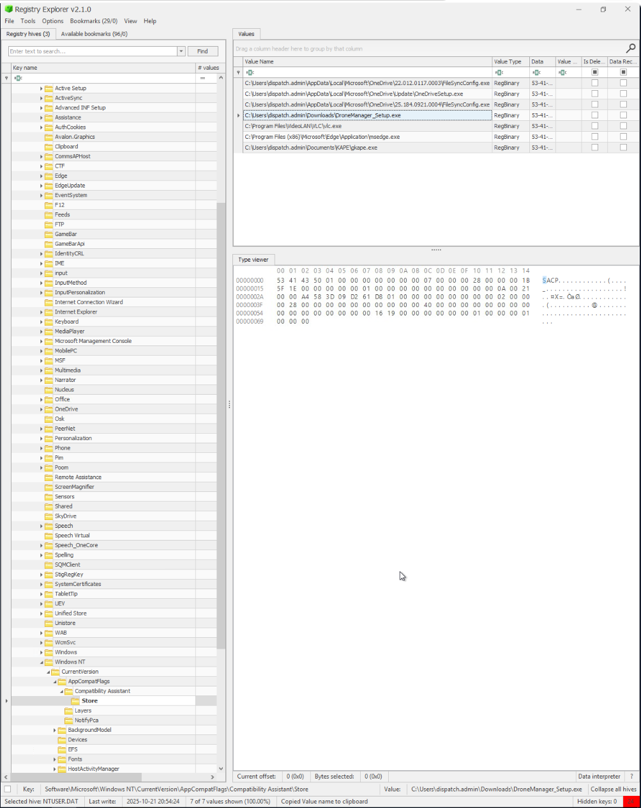
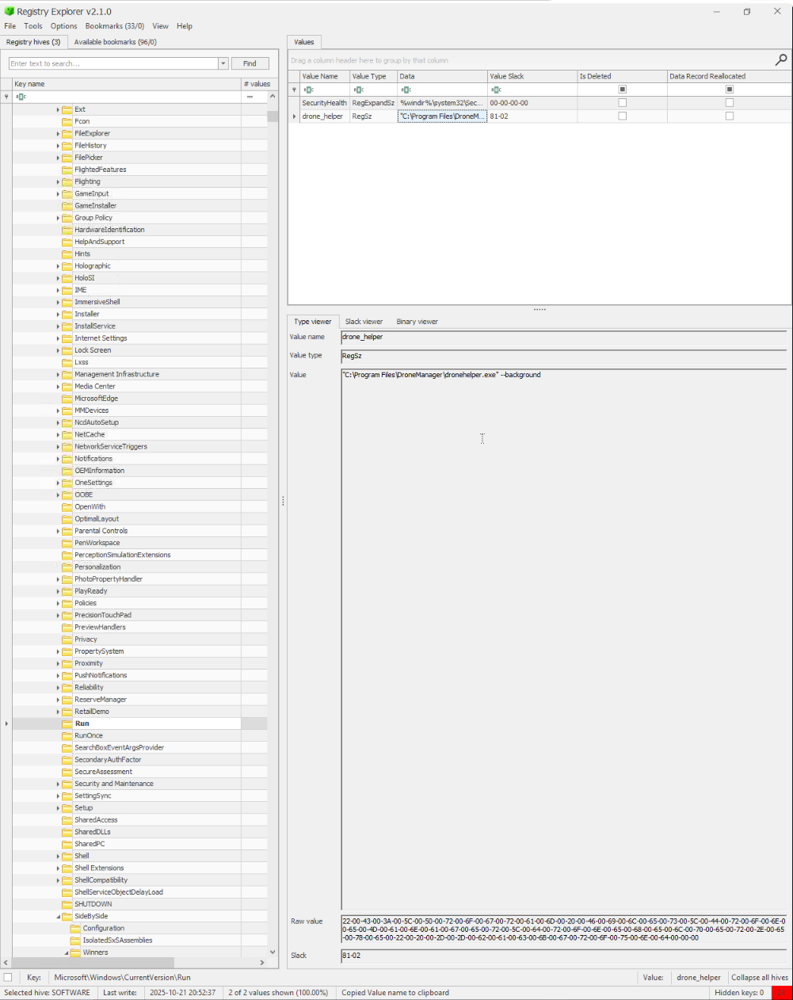

# 🎄 Dzień 16 - Forensics - Registry Furensics

## 📝 Opis zadania
*Szesnasty dzień wyzwania poświęcony był analizie śledczej rejestru systemu Windows (Windows Registry) na zaatakowanym serwerze `dispatch-srv01`. Celem dochodzenia było odnalezienie dowodów infiltracji przez King Malhare, identyfikacja złośliwego oprogramowania zainstalowanego tuż przed incydentem (21 października 2025) oraz wykrycie metod utrzymania trwałości (Persistence) w systemie.*

## 🔍 Kroki do celu
1. **Ekstrakcja i ładowanie gałęzi rejestru (Hives)**: 
Proces rozpoczęto od zabezpieczenia kluczowych plików rejestru: SYSTEM, SOFTWARE oraz NTUSER.DAT. Do ich analizy wykorzystano narzędzie Registry Explorer (autorstwa Erica Zimmermana). Kluczowym krokiem było poprawne załadowanie logów transakcyjnych (transaction logs), co pozwoliło na odzyskanie nieutrwalonych danych i uzyskanie spójnego obrazu bazy.
2. **Identyfikacja systemu i użytkownika**: 
W celu weryfikacji tożsamości badanego urządzenia, przeanalizowano klucz ComputerName.

* Ścieżka: `ROOT\ControlSet001\Control\ComputerName\ComputerName`

* Wynik: Potwierdzono, że badaną maszyną jest DISPATCH-SRV01.
3. **Analiza oprogramowania i ścieżek uruchomienia**: 
Skupiono się na aktywności z dnia 21.10.2025. Przeszukano klucze odpowiedzialne za zainstalowane aplikacje oraz artefakt UserAssist, który przechowuje informacje o uruchamianych programach, liczbie ich uruchomień oraz dokładnych ścieżkach dostępu.
```
PowerShell
# Klucz sprawdzany pod kątem zainstalowanych aplikacji:
SOFTWARE\Microsoft\Windows\CurrentVersion\Uninstall

# Klucz Store (śledzenie wykonania programów):
ROOT\Software\Microsoft\Windows NT\CurrentVersion\AppCompatFlags\Compatibility Assistant\Store
```
4. **Wykrywanie mechanizmów trwałości (Persistence)**:
Najważniejszym punktem było znalezienie sposobu, w jaki złośliwa aplikacja zapewniała sobie automatyczny start przy każdym uruchomieniu serwera. Przeanalizowano tzw. "Run Keys", gdzie intruz dodał nową wartość wskazującą na złośliwy plik wykonywalny.
```
PowerShell
# Lokalizacja kluczy automatycznego startu:
SOFTWARE\Microsoft\Windows\CurrentVersion\Run
```

## 📸 Dokumentacja wizualna

*Interfejs Registry Explorer z załadowanymi gałęziami SOFTWARE i SYSTEM.*

*Detale klucza UserAssist ujawniające pełną ścieżkę uruchomienia złośliwego narzędzia.*

*Widok klucza Run z wpisem zapewniającym trwałość ataku.*

## 🛠️ Użyte narzędzia
* Registry Explorer – zaawansowane narzędzie do przeglądania i analizy gałęzi rejestru offline.
* Windows Registry Editor (regedit) – do wstępnego podglądu struktury kluczy.
