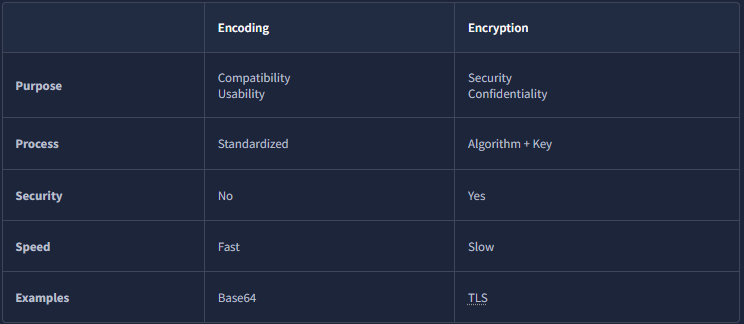
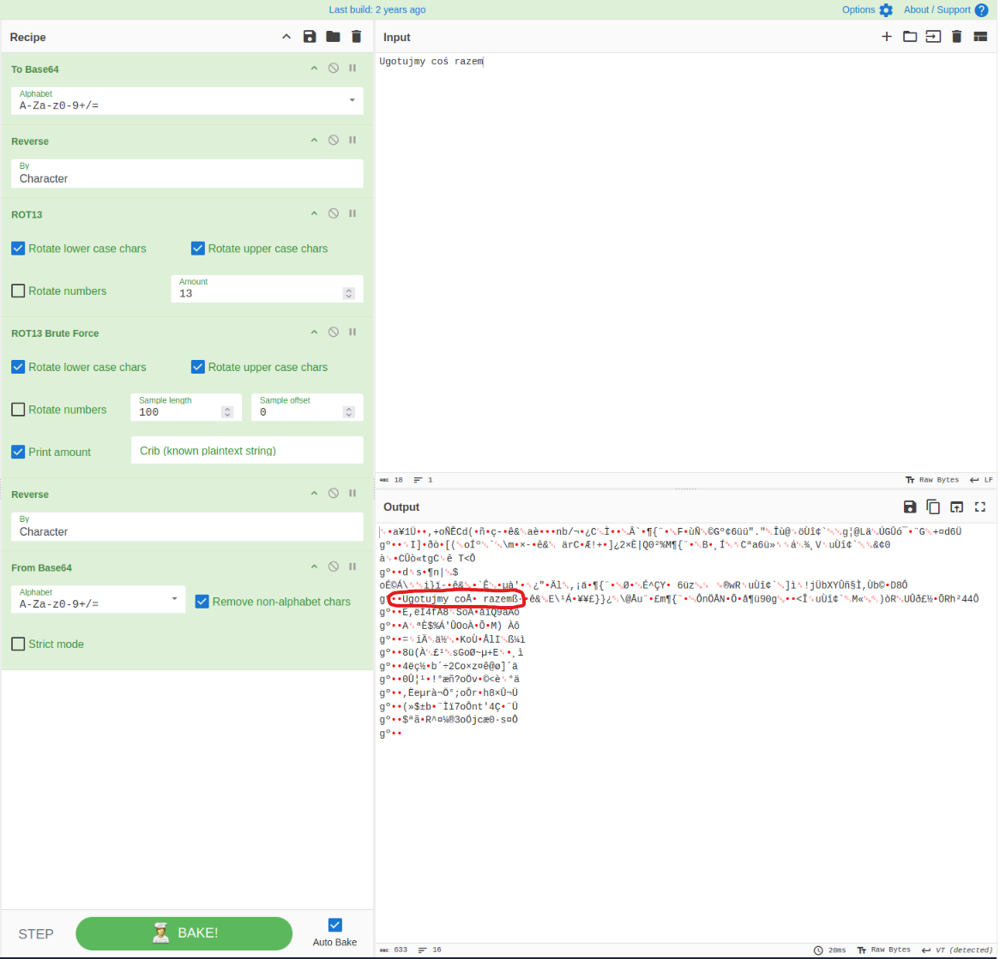
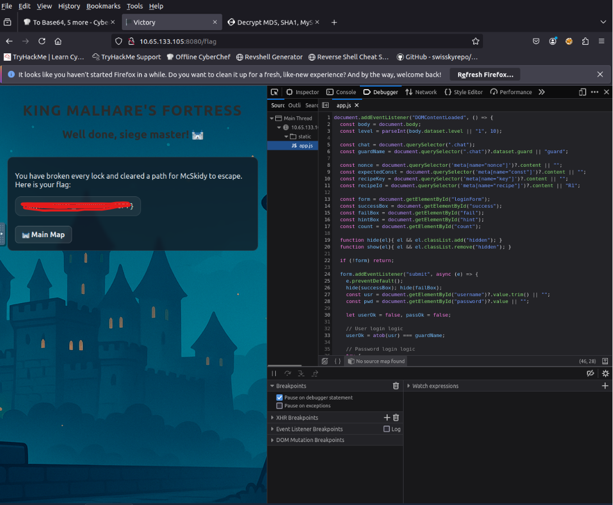
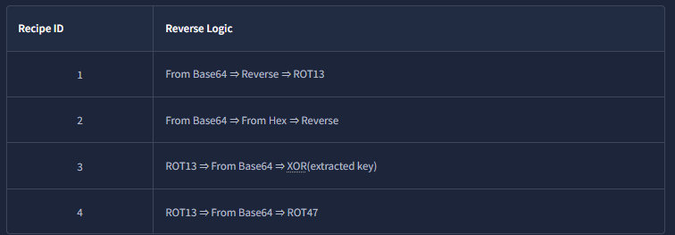

# 🎄 Dzień 17 - CyberChef - Hoperation Save McSkidy

## 📝 Opis zadania
*Siedemnasty dzień wyzwania koncentrował się na technikach kodowania i dekodowania danych. Celem było złamanie pięciu zamków zabezpieczających więzienie "Quantum Warren", w którym uwięziono McSkidy. Zadanie wymagało identyfikacji metod transformacji danych (takich jak Base64, ROT13, Hex czy XOR) oraz budowania zaawansowanych receptur w narzędziu CyberChef w celu odzyskania ukrytych haseł.*

## 🔍 Kroki do celu
1. **Analiza różnic między kodowaniem a szyfrowaniem**: 
Pierwszym krokiem było zrozumienie fundamentów: kodowanie służy do zapewnienia kompatybilności danych, podczas gdy szyfrowanie zapewnia ich poufność. Pozwoliło to na szybką identyfikację standardowych formatów przesyłania informacji w nagłówkach HTTP i komunikatach strażników.
2. **Rekonesans i przechwytywanie danych**: 
Informacje potrzebne do otwarcia zamków pozyskano z nagłówkow HTTP i Czatu: analiza ruchu sieciowego pozwoliła na wyodrębnienie zakodowanych ciągów znaków oraz "Recipe ID", wskazujących na kolejność operacji dekodujących.
3. **Łamanie zamków przy użyciu CyberChef**: 
Kluczowym etapem było stworzenie precyzyjnych receptur dla każdego z pięciu zamków. Wykorzystano m.in. następujące techniki:

* Zamki 1 i 2: Base64 oraz podwojne Base64

* Zamek 3: Base64 oraz XOR z uzyciem wyodrebionego klucza

* Zamek 4: Base64 oraz md5

* Zamek 5: ROT13, Base64 oraz ROT47 na koncu.

## 📸 Dokumentacja wizualna

*Tabela porównawcza Encoding vs Encryption jako podstawa teoretyczna zadania.*

*Proces budowania receptury w CyberChef (np. From Base64 -> Reverse -> ROT13).*

*Moment złamania piątego zamka i uzyskanie końcowej flagi.*

*Tabela porownawcza RecipeID*

## 🚩 Znalezione flagi
| Nazwa flagi | Wartość |
| :--- | :--- |
| Flaga użytkownika | `THM{...}` |

## 🛠️ Użyte narzędzia
* [Narzędzie 1]
* [Narzędzie 2]
