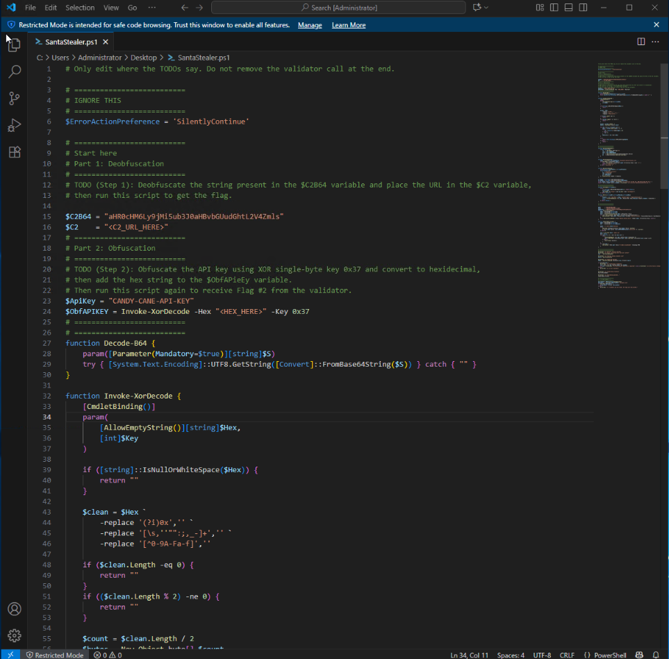
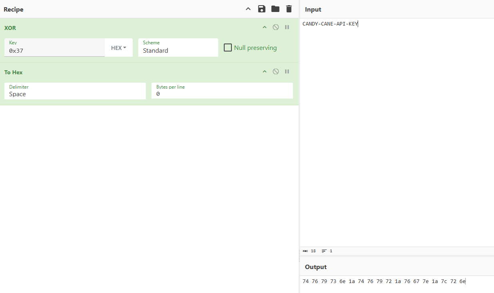
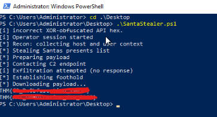

# 🎄 Dzień 18 - Obfuscation - The Egg Shell File

## 📝 Opis zadania
*Osiemnasty dzień wyzwania skupiał się na analizie i manipulacji złośliwym skryptem PowerShell (`SantaStealer.ps1`). Zadanie polegało na przeprowadzeniu deobfuskacji adresu serwera C2 oraz wykonaniu aktywnej obfuskacji klucza API przy użyciu operacji XOR i konwersji na system szesnastkowy.

## 🔍 Kroki do celu
1. **Deobfuskacja adresu C2**:
Pierwszym krokiem była analiza sekcji deobfuskacji w skrypcie. Zidentyfikowano zmienną $C2B64, która zawierała adres URL zakodowany w formacie Base64. Zadanie wymagało odkodowania tego ciągu i przypisania czystego adresu URL do zmiennej $C2, co udało się osiągnąć przy użyciu CyberChef.
2. **Obfuskacja klucza API (XOR + HEX)**: 
Druga część zadania wymagała przygotowania ładunku (payloadu) w taki sposób, w jaki zrobiłby to autor malware. Należało pobrać klucz API napastnika i poddać go dwustopniowej obfuskacji:

* XOR: Użycie pojedynczego bajtu klucza o wartości 0x37.
* HEX: Konwersja wynikowych bajtów na ciąg szesnastkowy (hexadecimal).

Wynik należało umieścić w zmiennej $ObfAPieEy. Ponowne uruchomienie skryptu skutkowało odsłonięciem drugiej flagi.

> [!TIP: Obfuskacja vs Szyfrowanie]
> Warto pamiętać, że obfuskacja ma na celu jedynie utrudnienie czytelności kodu dla człowieka i prostych skanerów, podczas gdy szyfrowanie (Encryption) służy do pełnej ochrony poufności danych przy użyciu kluczy kryptograficznych.

## 📸 Dokumentacja wizualna

*Analiza złośliwego skryptu w Visual Studio Code.*

*Proces wyliczania wartości XOR 0x37 dla klucza API (np. przy użyciu CyberChef lub skryptu pomocniczego).*

*Konsola PowerShell wyświetlająca Flagę #1 oraz Flagę #2 po poprawnej walidacji.*

## 🛠️ Użyte narzędzia
* PowerShell
* Visual Studio Code
* CyberChef
