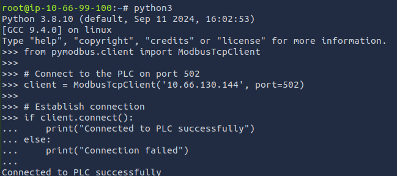
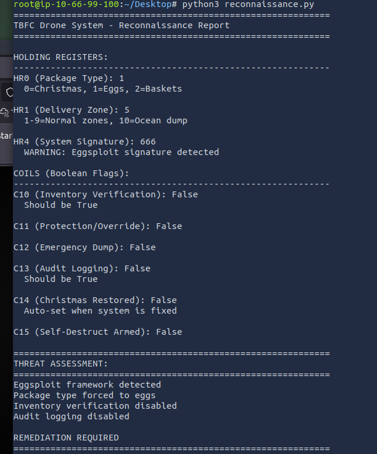
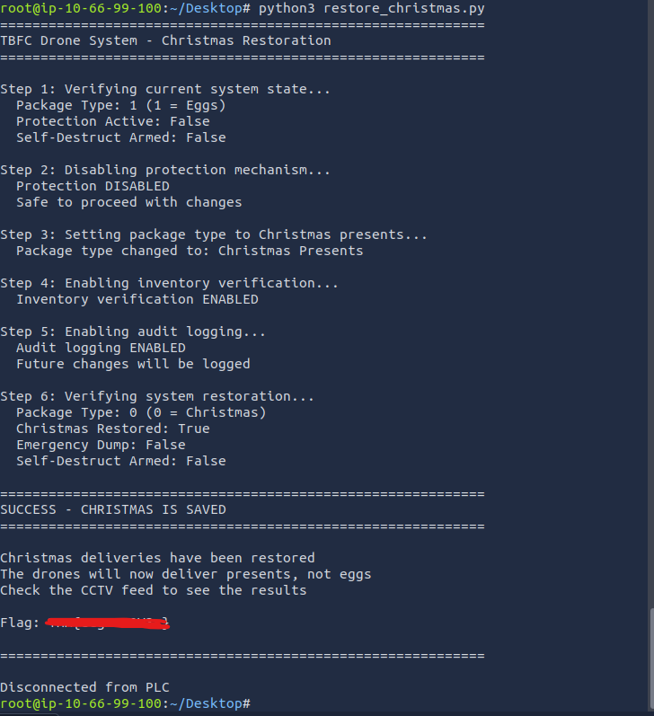

# 🎄 Dzień 19 - ICS/Modbus - Claus for Concern

## 📝 Opis zadania
*Dziewiętnasty dzień wyzwania dotyczył bezpieczeństwa systemów automatyki przemysłowej (ICS/SCADA). Zadanie polegało na analizie i remediacji incydentu w centrum logistycznym floty dronów. Dochodzenie wykazało, że King Malhare przejął kontrolę nad sterownikami PLC (Programmable Logic Controllers) za pomocą niezabezpieczonego protokołu Modbus, co spowodowało podmianę przesyłek świątecznych na czekoladowe jaja.*

## 🔍 Kroki do celu
1. **Manualna analiza rejestrów (Python Interpreter)**: 
Zidentyfikowano, że system zarządzania dronami opiera się na protokole Modbus działającym na standardowym porcie 502. Ze względu na brak wbudowanych mechanizmów uwierzytelniania w tym protokole, napastnik był w stanie bezpośrednio odczytywać i modyfikować wartości w rejestrach sterownika PLC.
2. **Manualna analiza rejestrów (Python Interpreter)**: 
Wstępny rekonesans przeprowadzono za pomocą biblioteki pymodbus. Połączono się ze sterownikiem PLC na porcie 502. Brak wymogu uwierzytelniania pozwolił na bezpośredni odczyt rejestrów holdingowych (HR) oraz cewek (Coils).

* HR0 (Package Type): Wartość 1 (Chocolate Eggs) – potwierdzenie sabotażu.
* HR4 (Signature): Wartość 666 – sygnatura frameworka Eggsploit.
* 11 (Protection): Wartość True – wykrycie aktywnej pułapki monitorującej zmiany.
3. **Pełny audyt systemu (reconnaissance.py)**: 
Wykorzystano skrypt do kompleksowego zmapowania stanu PLC. Raport potwierdził krytyczne zagrożenie: próba zmiany HR0 przy aktywnym C11 skutkuje uzbrojeniem C15 (Self-Destruct) i zrzutem ładunku do oceanu (Zone 10) po 30 sekundach.
4. **Precyzyjna remediacja (restore_christmas.py)**:
Aby uratować święta, zaimplementowano skrypt naprawczy wykonujący operacje w ściśle określonej, bezpiecznej kolejności:

* Dezaktywacja C11 (Wyłączenie pułapki).
* Zmiana HR0 na 0 (Przywrócenie prezentów).
* Aktywacja C10 i C13 (Przywrócenie weryfikacji i logowania zdarzeń.

Finałowy krok obejmował odczyt rejestrów od adresu 20, z których zdekodowano flagę.

## 📸 Dokumentacja wizualna

*Manualna sesja w pythonie - próba połączenia się ze sterownikiem PLC poprzez modbus TCP na porcie 502.*

*Wynik działania reconnaissance.py z pełnym zestawieniem "Threat Assessment".*

*Logi ze skryptu restore_christmas.py kończące się komunikatem "SUCCESS" i wyświetleniem flagi.

## 🛠️ Użyte narzędzia
* PyModbus (v3.6.8) – biblioteka Python do komunikacji ze sterownikami PLC.
* Python 3 – automatyzacja procesu odczytu i zapisu rejestrów.
* Modbus TCP (Port 502) – protokół przemysłowy poddany analizie.
