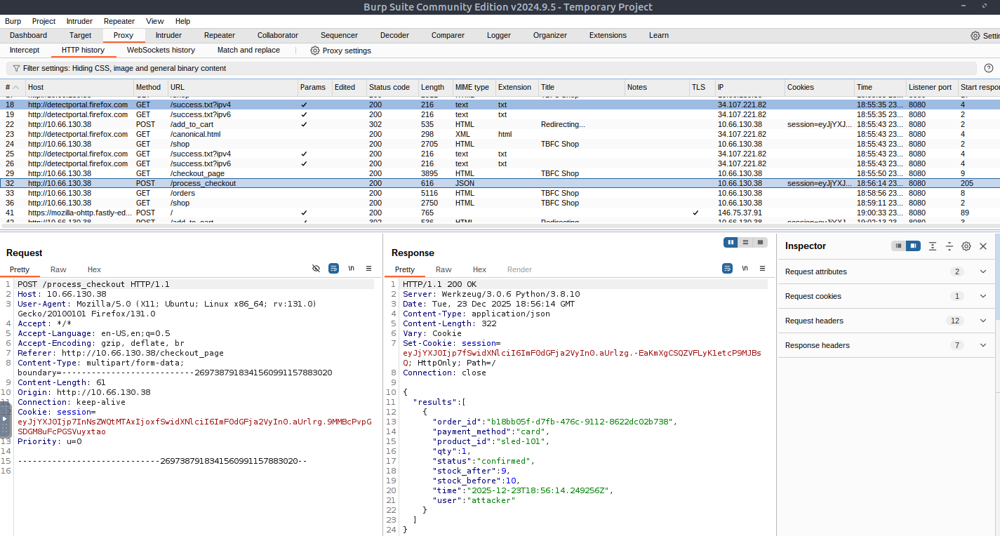
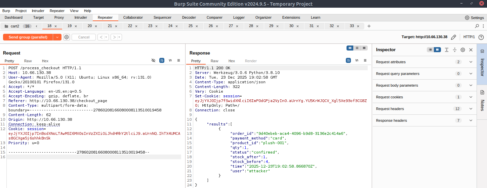
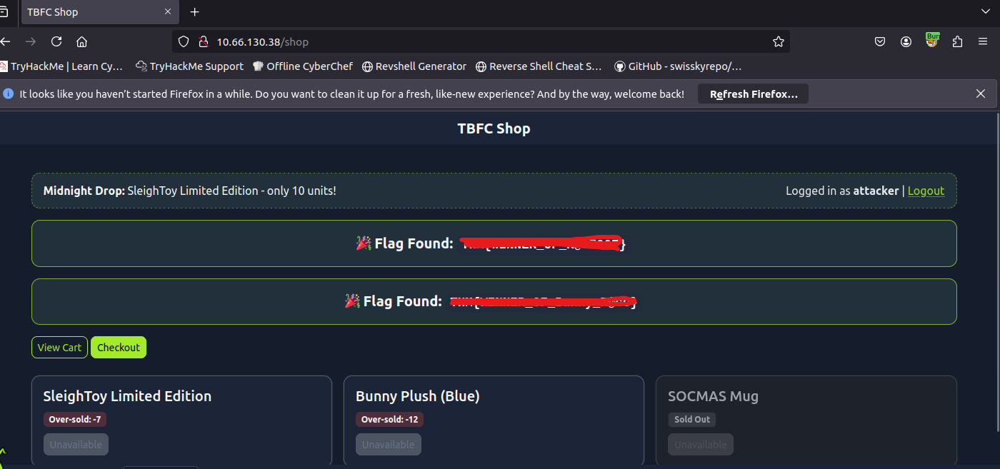

# 🎄 Dzień 20 - Race Conditions - Toy to The World

## 📝 Opis zadania
*Dwudziesty dzień wyzwania dotyczył analizy błędu logicznego w aplikacji webowej sklepu TBFC. Problem polegał na tym, że mimo ograniczonej liczby sztuk produktu "SleighToy Limited Edition" (tylko 10 sztuk), zamówienie zdołało złożyć znacznie więcej osób. Zadanie wymagało zidentyfikowania luki typu Race Condition podczas procesu finalizacji zakupu i wykorzystania jej do doprowadzenia stanu magazynowego do wartości ujemnych.*

## 🔍 Kroki do celu
1. **Analiza procesu zakupowego**: 
Przeprowadzono standardowy proces zakupu, aby zidentyfikować krytyczne punkty styku z bazą danych. Ustalono, że aplikacja sprawdza dostępność towaru, a następnie odejmuje go ze stanu. Punktem wejścia do ataku okazał się endpoint /process_checkout.
2. **Przechwycenie żądania (Burp Suite)**: 
Wykorzystano Burp Suite do przechwycenia żądania POST wysyłanego podczas finalizacji zamówienia. Żądanie to zawierało informacje o sesji użytkownika, do której przypisany był przedmiot w koszyku.
3. **Wykorzystanie luki Race Condition**:
Atak polegał na wysłaniu dużej liczby identycznych żądań zakupu w tym samym ułamku sekundy (równolegle). Dzięki temu, że aplikacja nie stosowała blokad atomowych na poziomie bazy danych, wiele procesów odczytało stan "dostępny" zanim pierwszy z nich zdążył go zaktualizować (odjąć sztukę).
* Technika: Wysłanie zsynchronizowanych żądań w grupach (Parallel Requests).
* Efekt: System zaakceptował więcej zamówień niż pozwalał na to stan magazynowy.
4. **Uzyskanie flagi i analiza regresji**:
Po pomyślnym przeprowadzeniu ataku, stan magazynowy produktu spadł poniżej zera (wartość ujemna). W tym momencie aplikacja wyświetliła ukrytą flagę. Proces powtórzono dla drugiego przedmiotu ("Bunny Plush"), co pozwoliło na zdobycie kolejnej flagi.

> 🛡️ Rekomendacje (Mitigation)
> Aby zapobiec takim atakom, systemy powinny:
* Stosować atomowe transakcje w bazie danych `(np. UPDATE stock SET count = count - 1 WHERE id = 1 AND count > 0)`.
* Implementować klucze idempotencji dla żądań checkout.
* Wprowadzić blokady optymistyczne/pesymistyczne na poziomie rekordów w bazie.

## 📸 Dokumentacja wizualna

*Przechwycone żądanie /process_checkout w Burp Suite gotowe do wysłania w pętli.*

*Konfiguracja ataku równoległego mająca na celu oszukanie licznika produktów.*

*Widok panelu sklepu z ujemnym stanem magazynowym (In Stock: -7) oraz wyświetloną flagą.*

## 🛠️ Użyte narzędzia
* Burp Suite – przechwytywanie i modyfikacja żądań oraz ataki równoległe.
* Web Browser – weryfikacja wyników ataku na frontendzie aplikacji.
