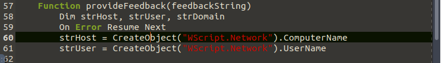
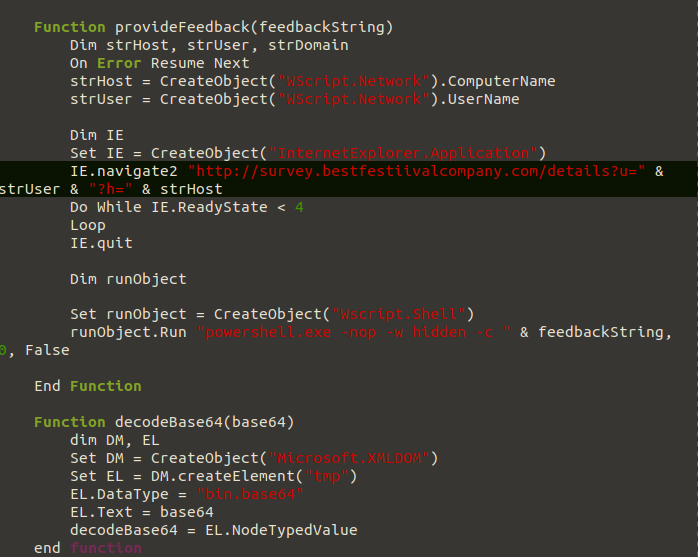
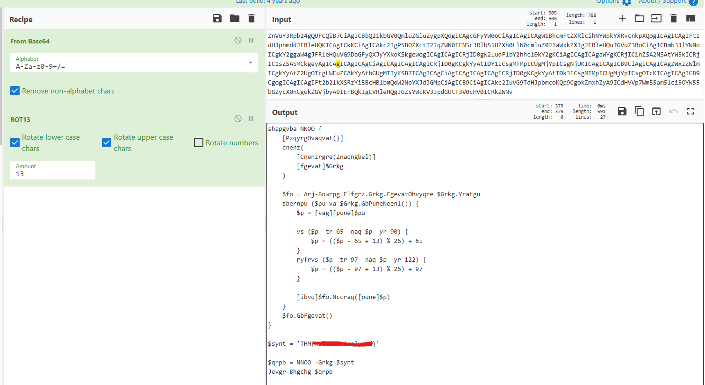

# 🎄 Dzień 21 - Malware Analysis - Malhare.exe

## 📝 Opis zadania
*Dzień siedemnasty (zgodnie z notatkami) skupiał się na analizie złośliwego pliku HTA (HTML Application). Zadanie polegało na zbadaniu kodu VBScript ukrytego wewnątrz aplikacji, która pod pozorem niewinnej ankiety pracowniczej ("Anonymous Salary Feedback") wykradała dane systemowe i uruchamiała złośliwy ładunek PowerShell.*

## 🔍 Kroki do celu
1. **Analiza statyczna i socjotechnika**: 
Przeanalizowano strukturę pliku HTA. Warstwa wizualna (HTML/CSS) udaje formularz opinii o wynagrodzeniu, obiecując uczestnikom szansę na wygraną wycieczki na Biegun Południowy. Prawdziwa logika ataku została zaszyta wewnątrz tagów `<script type="text/vbscript">`.
2. **Pobieranie ładunku (Stage 1)**: 
Funkcja `getQuestions()` inicjuje atak. Wykorzystuje obiekt `InternetExplorer.Application` do pobrania zakodowanej zawartości z adresu: `http://survey.bestfestiivalcompany.com/survey_questions.txt` Pobrane dane są następnie dekodowane z formatu Base64 i konwertowane na tekst za pomocą strumienia ADODB.
3. **Eksfiltracja danych (Host Reconnaissance)**: 
Funkcja `provideFeedback()` zbiera informacje o zainfekowanym hoście. Przy użyciu obiektu `WScript.Network` pobierane są:
* ComputerName (Nazwa komputera)

* UserName (Nazwa użytkownika)

Dane te są przesyłane do serwera atakującego metodą GET poprzez parametry zapytania w adresie URL: `http://survey.bestfestiivalcompany.com/details?u=[User]?h=[Host]`
4. **Analiza i dekodowanie ładunku drugiego stopnia (Stage 2)**:
W związku z niedostępnością oryginalnej witryny malware, analizę przeprowadzono na zabezpieczonej kopii ładunku. Pierwszą warstwą zaciemniania danych (obfuskacji) był popularny schemat kodowania Base64.

Po odkodowaniu Base64 uzyskano skrypt PowerShell z funkcją o nazwie AABB. Analiza statyczna kodu wykazała, że funkcja ta implementuje algorytm ROT13 poprzez bezpośrednią manipulację wartościami ASCII znaków:
* Program sprawdza zakresy 65-90 (wielkie litery) oraz 97-122 (małe litery).
* Zastosowano operację przesunięcia o 13 pozycji.

Odkrycie to pozwoliło na zidentyfikowanie mechanizmu "przesuwania" liter i zdeszyfrowanie zakodowanej zmiennej `$flag = 'GUZ{Znyjner.Nanylfrq}'`. Po zastosowaniu transformacji ROT13 przy użyciu CyberChef, uzyskano czytelną flagę.

## 📸 Dokumentacja wizualna

*Kod VBScript odpowiedzialny za zbieranie danych o systemie.*

*Moment wywołania powershell.exe z ukrytym ładunkiem.*

*Receptura w CyberChef (Base64 -> AES) użyta do analizy zewnętrznego payloadu.*

## 🛠️ Użyte narzędzia
* Text Editor – analiza kodu VBScript/HTML.
* CyberChef – dekodowanie Base64 i ROT13.
