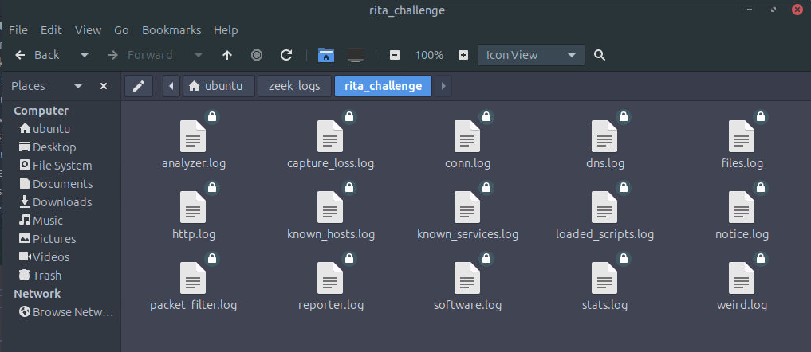
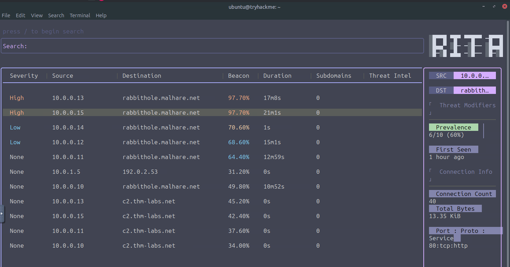
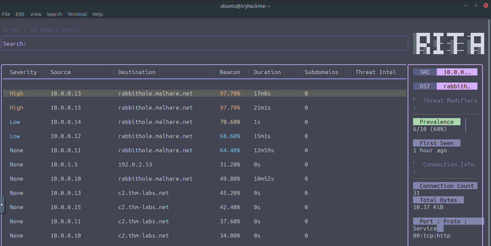

# 🎄 Dzień 22 - C2 Detection - Command & Carol

## 📝 Opis zadania
*Dwudziesty drugi dzień wyzwania to zaawansowany Threat Hunting w ruchu sieciowym. Głównym celem było wykrycie komunikacji Command and Control (C2) ukrytej wewnątrz dużego zbioru danych sieciowych. Wykorzystano narzędzia Zeek (do ekstrakcji logów z PCAP) oraz RITA (do analizy statystycznej beaconingu i anomalii), aby zidentyfikować infrastrukturę grupy King Malhare..*

## 🔍 Kroki do celu
1. **Generowanie logów sieciowych (Zeek)**: 
Analizę rozpoczęto od przetworzenia pliku `rita_challenge.pcap` na ustrukturyzowane logi. Silnik Zeek wyodrębnił kluczowe informacje o połączeniach (`conn.log`), zapytaniach DNS (`dns.log`) oraz certyfikatach, tworząc bazę do dalszego badania.
```
Bash
# Konwersja PCAP do formatu logów Zeek
zeek readpcap pcaps/rita_challenge.pcap zeek_logs/rita_challenge && cd /home/ubuntu/zeek_logs/rita_challenge && ls
```
2. **Import i analiza w systemie RITA**: 
Dane zostały zaimportowane do bazy danych RITA. Narzędzie przeprowadziło analizę połączeń pod kątem Prevalence (liczba hostów łączących się z danym celem) oraz Beacon Score (rytmiczność połączeń charakterystyczna dla malware).
```
Bash
# Import logów do bazy danych rita_challenge
rita import --logs ./zeek_logs/rita_challenge --database rita_challenge
```
3. **Interaktywna analiza w RITA View**: 
Wykorzystano interaktywny widok terminalowy (CMD), aby przefiltrować wyniki i odpowiedzieć na kluczowe pytania dotyczące infrastruktury napastnika.
```
Bash
# Uruchomienie interfejsu przeglądania danych
rita view rita_challenge
```
4. **Wyniki dochodzenia**
Wykonana analiza pozwoliła na zidentyfikowanie złośliwego ruchu skierowanego do adresu rabbithole.malhare.net oraz odpowiedzi na pytania:
* Liczba hostów komunikujących się z malhare.net - **6**
* Modyfikator określający liczbę hostów - **prevalence**
* Najwyższa liczba połączeń do rabbithole.malhare.net - **40**
* Port użyty przez host 10.0.0.13 do komunikacji - **80**
* Użyty filtr wyszukiwania - `dst:rabbithole.malhare.net beacon:>=70 sort:duration-desc`

## 📸 Dokumentacja wizualna

*Lista wygenerowanych logów Zeek potwierdzająca udaną konwersję ruchu sieciowego.*

*Panel RITA z widocznym zestawieniem domen i wysokim wynikiem Beacon Score dla malhare.net.*

*Szczegóły połączenia hosta 10.0.0.13 na porcie 80, wskazujące na aktywność C2.*

## 🛠️ Użyte narzędzia
* Zeek – potężny analizator ruchu sieciowego (Network Security Monitor).
* RITA (Real Intelligence Threat Analytics) – framework do wykrywania beaconingu i tunelowania DNS.
