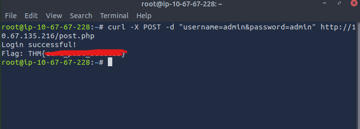
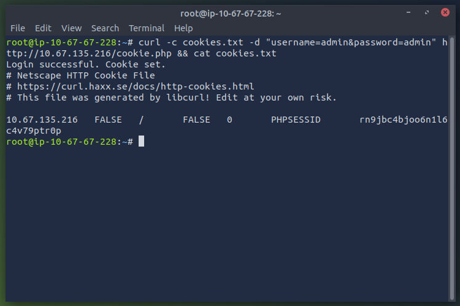
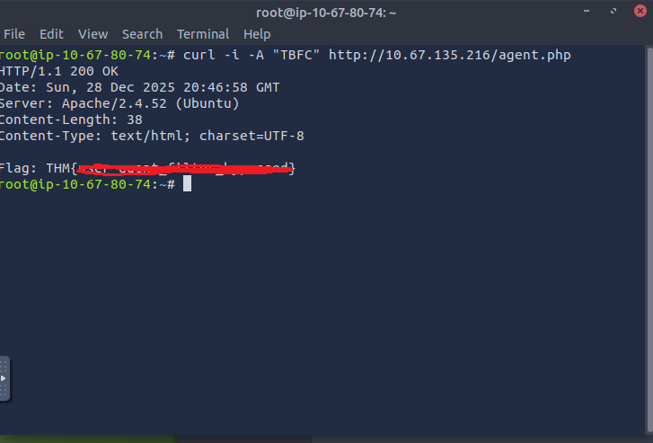

# 🎄 Dzień 24 - Exploitation with cURL - Hoperation Eggsploit

## 📝 Opis zadania
Dwudziesty czwarty, finałowy dzień wyzwania to sprawdzian umiejętności manualnej interakcji z aplikacjami webowymi. W scenariuszu, w którym nie mamy dostępu do przeglądarki ani narzędzi z graficznym interfejsem (jak Burp Suite), kluczowa staje się biegłość w obsłudze narzędzia wiersza poleceń cURL. Zadanie polegało na manipulacji żądaniami HTTP (metody GET/POST, ciasteczka, nagłówki User-Agent) oraz przeprowadzeniu ataku brute-force w celu wyłączenia panelu sterowania złośliwych królików i zamknięcia tunelu czasoprzestrzennego.

## 🔍 Kroki do celu
1. **Manipulacja żądaniami POST**: 
Pierwszym krokiem było przesłanie danych uwierzytelniających do endpointu /post.php. W przeciwieństwie do metody GET, dane te musiały zostać przesłane w ciele żądania (body).
```
Bash
# Wysłanie danych logowania metodą POST
curl -X POST -d "username=adeln&password=adenin" http://[MACHINE_IP]/post.php
```
2. **Zarządzanie sesją (Cookies)**:
Następnie zademonstrowano umiejętność obsługi stanu sesji. Serwery HTTP są bezstanowe, więc do utrzymania zalogowania używa się ciasteczek. Zadanie wymagało uwierzytelnienia się jako admin, zapisania otrzymanego ciasteczka do pliku, a następnie ponownego jego użycia, aby uzyskać dostęp do chronionego zasobu.
```
Bash
# Logowanie i zapisanie ciasteczka do pliku (cookie-jar)
curl -c cookies.txt -d "username=admin&password=admin" http://[MACHINE_IP]/cookie.php

# Użycie zapisanego ciasteczka do autoryzacji
curl -b cookies.txt http://[MACHINE_IP]/cookie.php
```
3. **Omijanie filtrów (User-Agent Spoofing)**: 
Kolejne zabezpieczenie opierało się na sprawdzaniu nagłówka User-Agent. Serwer odrzucał standardowe żądania, oczekując specyficznego identyfikatora klienta.
```
Bash
# Spoofing nagłówka User-Agent
curl -A "TBFC" http://[MACHINE_IP]/agent.php
```
4. **Bonus: Atak Brute-Force (Password & PIN)**:
Ostatnia faza wymagała złamania zabezpieczeń metodą siłową.
Hasło Admina: Wykorzystano skryptowanie w Bashu do iteracji po liście haseł w celu znalezienia poprawnego hasła do endpointu /bruteforce.php.

5. **Bonus Mission: Próba zamknięcia tunelu czasoprzestrzennego**:
Ostatnim, dodatkowym wyzwaniem było zamknięcie tunelu ("wormhole") poprzez panel sterowania królików. Zadanie wymagało złożonej interakcji z API, łączącej spoofing, łamanie PIN-u oraz uwierzytelnianie.

Rekonesans i User-Agent Analiza wykazała, że serwer pod adresem `terminal.php?action=panel` odrzuca standardowe połączenia. Metodą prób i błędów ustalono, że wymagany jest nagłówek `User-Agent: secretcomputer`. Użycie go ujawniło dostępne endpointy:
* `?action=info` – informacje ogólne.
* `?action=login` – logowanie (wymaga POST: username, password).
* `?action=pin` – autoryzacja PIN (wymaga POST: pin).
* `?action=status` – status tunelu (wymaga sesji administratora).
* `?action=close` – zamknięcie tunelu (wymaga sesji, tokena i nagłówka X-Force).

Odkrycie PIN-u (Brute-Force) Zidentyfikowano endpoint `?action=pin`, który wymagał 4-cyfrowego kodu. Przygotowano skrypt w Bashu iterujący po zakresie 4000-5000. Sukces: Znaleziono poprawny PIN: 4731. Odpowiedź serwera dla poprawnego PIN-u sugerowała odblokowanie dostępu do `Operator Token` lub nagłówka `X-Force`, niezbędnych w dalszej fazie.

Próba uwierzytelnienia (Ściana) Kluczowym elementem do wykonania akcji close oraz odczytania pełnego `status` było uzyskanie ciasteczka sesyjnego administratora. Podjęto próby ataku słownikowego (brute-force) na endpoint ?`action=login` dla użytkownika admin, wykorzystując listę `rockyou.txt` oraz User-Agenta `secretcomputer`. Mimo zastosowania zautomatyzowanych skryptów, nie udało się uzyskać poprawnej odpowiedzi potwierdzającej logowanie. Bez aktywnej sesji (`PHPSESSID`):
* Nie można odczytać ukrytych danych w `?action=status`.
* Nie można autoryzować finalnego zapytania `?action=close`, mimo posiadania PIN-u.

Wniosek: Ścieżka ataku została zmapowana: `User-Agent -> PIN -> Login (Sesja) -> Status (Header) -> Close`. Ze względu na trudności w etapie uwierzytelniania, proces zakończono na pomyślnym złamaniu zabezpieczenia PIN.

> 💡 Wiedza techniczna: Potęga cURL
> cURL (Client URL) to "szwajcarski scyzoryk" w komunikacji sieciowej. Pozwala na precyzyjną kontrolę każdego bajtu wysyłanego do serwera, co jest niemożliwe w standardowej przeglądarce. Jest niezastąpiony przy automatyzacji testów bezpieczeństwa (API), debugowaniu połączeń oraz w środowiskach, gdzie dostępny jest tylko terminal.

## 📸 Dokumentacja wizualna


*Wynik żądania POST z widoczną flagą w odpowiedzi serwera.*


*Zawartość pliku cookies.txt potwierdzająca przechwycenie sesji.*


*Terminal wyświetlający flagę po prawidłowej manipulacji "User-Agent"*

## 🛠️ Użyte narzędzia
* cURL – narzędzie do transferu danych (HTTP/HTTPS).
* Bash – automatyzacja zapytań (pętle for/while).
* Terminal – środowisko pracy bez GUI.
